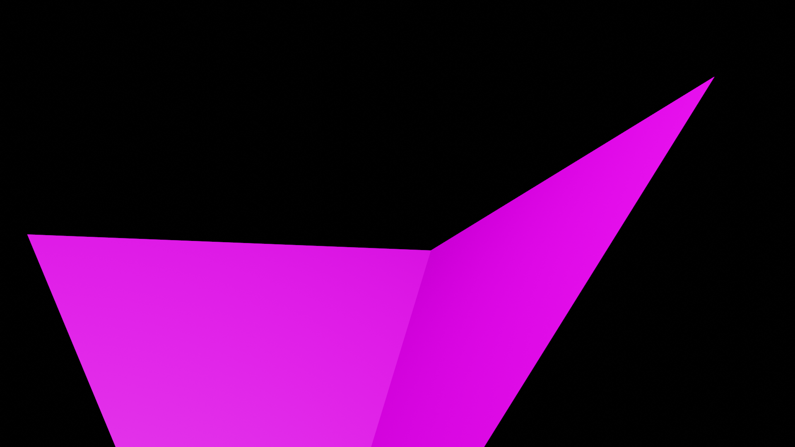
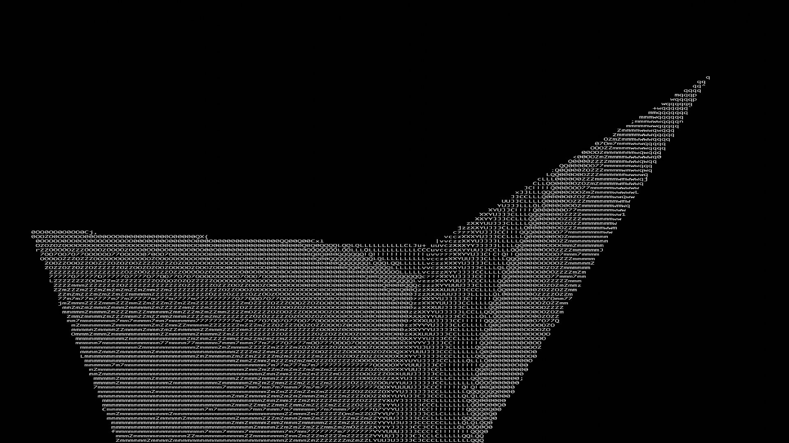

[Morgan's Blog](https://Morgan-Potter.github.io)

[Sam's Blog](https://samsidebotham.com)

[GitHub Repository - Winston](https://github.com/joush007/WINSTON) - All parts of the project are linked through submodules

# Creating a Mesh from a Point Cloud

Last week was interesting as I've been on the last 2 weeks of the first version of the assignment I'm working on for the rest of the year. I had talked previously about creating a 3d mesh from a point cloud in Blender, and talked about different methods of creating the faces after creating the vertices. I had thought it would be a simple process, but have recently discovered the need for an algorithm that will run through the vertices and figure out where the faces will be. To do this, I will be using the Ball Pivot Algorithm, which looks at a certain radius around a point and will connect 3 points if they are in close enough range to create a face.

# The Ball Pivot Algorithm

The Ball Pivot Algorithm can be thought of as a ball rolling around the vertices of a point cloud. It will roll along the object until if falls between three points, where it would 'get stuck'. Where the ball falls between three points is where a new face will be created, this is continued for the rest of the object and the accuracy of the algorithm comes from a changing radius of the ball. If the radius is large, the algorithm may be more accurate (to an extent) as it will be able to find vertices, but also may pick up vertices it shouldn't connect to. With a smaller radius, you may miss points in the mesh, but will be more accurate in the faces that are created. I will continue to look into the implementation of the algorithm this week.

If you'd like to read more about the algorithm before I implement it, you can read about it [here](http://mesh.brown.edu/taubin/pdfs/bernardini-etal-tvcg99.pdf)

# ASCII Integration

On the ASCII side of things, I was able to get working the process in which an object is rendered and then displayed in ASCII. Although it's not a perfect way of doing it and is slow to run in that you need two scenes and will have to continue switching between them to run each render, it still creates an ASCII version of the object in a 2d space from 3d as shown below.

The steps to doing it is simple, and I'll explain them by each scene. The first scene is simple, as it's just an object and a camera in the scene, with a light. The camera views the object with the light allowing it to pick up on the fact that there is an object. After it's rendered it is composited by Blender to save the image to a file. **That's it**, that's all that happens in that scene, but it is a necessary part of the process as it allows for taking the initial render of the object, which can't be done in the second scene.

The second scene takes the image from the first scene and uses it in a shader for a plane. The shader pixelates the image, takes the HSV value of the image, and then assigns an ASCII character to it based off of the HSV value of each pixel. This is a quick way of explaining it, but it's also only been implemented simply as I needed an initial proof of concept before even attempting to implement it in code. The full integration of this will not happen before the project will be submitted, and so I don't believe it's in a state to be submitted with the rest of the project in this state, and while the Point Cloud integration hasn't been implemented yet, I will continue to work on the rendering of the point cloud.

# Conclusion

Firstly, sorry that this post is a little bit later than usual, I will try to work on that in the future. Although I've gotten a lot done this week in Data Science, there is still a lot that I need to work on, specifically the implementation of PBA, which will take me a little bit in first understanding exactly what it does, and them implementing it in Python. I will halt my work on the ASCII side of things until the implementation of PBA is complete and I've got something resembling what I'm working towards in the project.

|To Do                                                     |Done|
|----------------------------------------------------------|----|
|Explore how Python interacts with Blender                 | x  |
|Create Mesh with Python in Blender                        | x  |
|Explore data output of CV                                 |    |
|Create mesh with output of CV                             |    |
|Make mesh with ASCII characters                           | x  |
|Explore how to constantly render mesh                     | x  |
|Implement Ball Point Algorithm                            |    |
|Constantly render mesh                                    |    |
|Test mesh creation and render with large mesh             |    |
|Any other ideas will be added to the table if this changes|    |