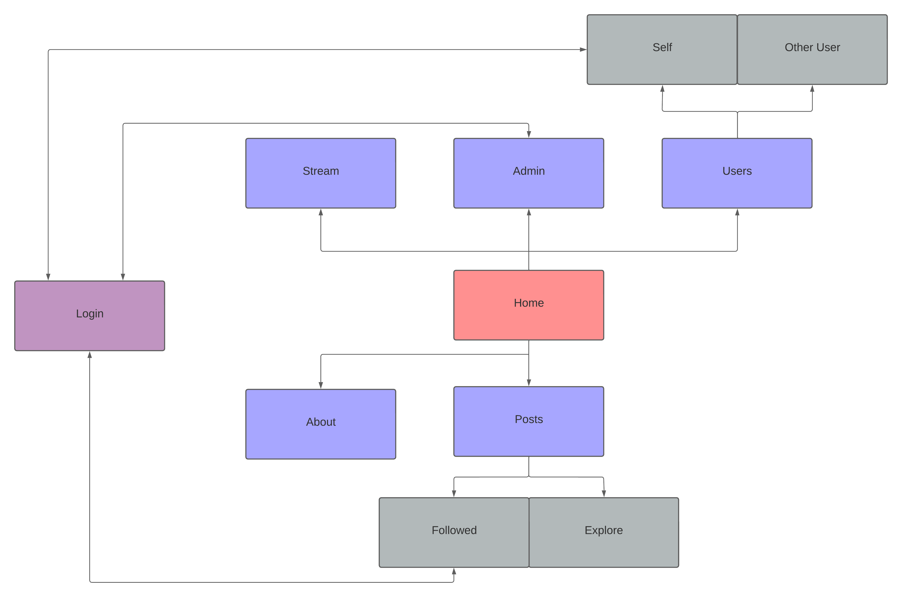

[Morgan's Blog](https://Morgan-Potter.github.io)

[Sam's Blog](https://samsidebotham.com)

[GitHub Repository - Winston](https://github.com/joush007/WINSTON) - All parts of the project are linked through submodules

# Winstogram
Firstly, I believe it is important to note, that Winstogram might not be the final name of the web app that is being created, but it would be pretty cool anyway, as the web app is a social media for W.I.N.S.T.O.N. (It was initally a site where we would live stream what W.I.N.S.T.O.N. can see, but I need something interactable and worthwhile for the web dev assignment).

# What is Winstogram?
Over the past week I spent a good amount of time working on the ideation of my web application. I had already decided that to fit withing the criteria of the website, I would be adding a social media-type aspect to the site, possibly working like Instagram, or Reddit, of which I was in need of talking to the team about. With that in mind I started ideating what the main parts of the website were going to incorporate, drawing up multiple versions of a sitemap to figure out the best design that incorporated the necessities of the site, and left out those that weren't needed.

# Layout of the website
I settled on a mostly top-level structure, because there really wasn't much that was needed on the actual layout of the website. The main pages included the Home, Stream, Admin, Users, About and Posts page. The purpose of these are as follows:



* Home - This is the landing page for the website, and will be the first page that is seen when someone visits the website, giving a brief overview of what W.I.N.S.T.O.N. is, and what the website is for.

* Stream - This is the page that will be used to display the live stream of what W.I.N.S.T.O.N. can see.

* Admin - The admin page can only be seen when logged into an account with admin privileges, but will incorporate seeing the backend of W.I.N.S.T.O.N. and the ability to send commands to W.I.N.S.T.O.N. directly. It will also show any data that is being sent to the website from W.I.N.S.T.O.N. and any other necessary information.

* Users - This page allows for people to view other users profiles, posts and other information that is being publicly shown on their profile. The page has two sub-pages, one for viewing other users, and one for viewing your own profile, where you will need to be logged in to view, as you can't view your own profile if you don't have a profile.

* About - The about page will give an overview of W.I.N.S.T.O.N., the team and the rest of the project that is being worked on. It will act as an informational page that if people are curious as to the reason we started this, or how we've been doing it, they can find out here. It will also include a bit about the team, that being Sam, Morgan and myself so that people can get a sense of who we are and what we do.

* Posts - The posts page is the main page for the web project, being the social media aspect of the site. It allows users to create posts, whether that is forums or images (I'm still deciding what type of posts there will be), and will allow for users to interact with each other through the posts through likes, comments and following people.

# Implementation
I got a lot of the work on the website done last week, setting up the app structure with each website and creating each page. The amount that was completed by the end of the week can be seen [here](https://github.com/joush007/Flask-Server-WINSTON/tree/0b0d720bab2d60e19748cfe22d1b0f75d5de2f23). In summary, I setup a basic app by creating the file structure with the `__init__.py` and `routes.py` as well as started working on the templates and CSS (which then I later stopped and switched to using tailwind as it's a lot easier to work with than pure CSS). In creating the structure and start of the website I did need to reference back to the microblog tutorial that was done previously, as I hadn't remembered exactly how I did a few key things, but once I went back through it, I was able to get a working website up and running. It should also be noted that I haven't yet setup a database for the users or posts, nor have I setup a login system or video display for the stream, but these will be added in the near future.

I did take a bit of a sidestep with the creation, though, as I got into creating the pages and getting a basic layout, I still haven't figured out what the pages will look like, thus this week I will be creating a wireframe to figure out how I want the pages to look, and from there it should be quite simple to implement those designs using html and tailwind. I got slightly carried away throughout the process of creating an initial page for the posts in the posts page with using dummy data. The data I was feeding in showed a title, body and image for each post, that linking to the <b>title</b>, the <b>caption</b> or <b>body</b> (if it's a forum type post) and the <b>image</b> for the post. The thing I got carried away with, though, was trying to mess around with a bunch of CSS to get the page to look nice, but as stated previously, this was pretty difficult to do without a wireframe to understand what I want the page to actually look like, and so now I have a bunch of html and CSS that's just sitting there and being a bit useless, but that's ok as I will be moving past that and making sure to use my time efficiently to develop a functional website.

The main thing that I implemented would be the `base.html` which is being built off of when using other templates. The code I ended up sticking with for it was this:

```html
<html>
<!-- Using Jinja templating so that you can use variables and code through flask's rendering of template -->
<head>
    
    <title>{{ title }} - W.I.N.S.T.O.N.</title>
    
    <title>W.I.N.S.T.O.N. the Robot Dog!</title>
    
    <!-- Link to stylesheets, my css and tailwind -->
    <link rel="stylesheet" href="{{ url_for('static',filename='styles.css') }}">
    <link rel="stylesheet" href="{{ url_for('static',filename='dist/css/output.css') }}">
</head>

<!-- Tailwind css setting background colours and flexboxes -->
<body class="bg-[var(--primary)]">
    <ul class="flex bg-[var(--secondary)]">
        <li class="">
            <a href="{{ url_for('index') }}"
                class="p-5 block lg:inline-block text-white {{ 'active' if request.path in [url_for('index'), '/'] else '' }}">Home</a>
        </li>
        <li class="">
            <a href="{{ url_for('stream') }}"
                class="p-5 block lg:inline-block text-white  {{ 'active' if request.path == url_for('stream') else '' }}">Stream</a>
        </li>
        <li class="">
            <a href="{{ url_for('winstogram') }}"
                class="p-5 block lg:inline-block text-white  {{ 'active' if request.path == url_for('winstogram') else '' }}">Winstogram</a>
        </li>
        <li class="">
            <a href="{{ url_for('about') }}"
                class="p-5 block lg:inline-block text-white  {{ 'active' if request.path == url_for('about') else '' }}">About</a>
        </li>
    </ul>
    <!-- Inset div to hold content, keeping consistent across pages -->
    <div class="p-10">
        <br>
        
    </div>

</body>

</html>
```

This sets up the navbar that will be referenced across all pages and leaves a section below it for the main content with padding that will also be shared across all pages such that the edges won't feel too cramped. The aim is to make the page feel a bit more spaced out through this. One thing to note is that there is a conditional in each of the links for the navbar when assigning the classes, which will give the active class to the active page by checking if the path to the current page fits with the specific link. This is necessary to do as I don't want the navbar to be repeated (using the DRY principle of programming [Don't Repeat Yourself]) across all templates. Thus by doing this, it will be in all pages, and doesn't require much code to find if the page is active or not and if to apply the class.

Although unnecessary to state, there was another important part of Flask that I figured out about, that being the static folder. This is a folder that is internally recognised by Flask under the `app/static/` directory, and therefore when using `url_for('static')`, it will direct to that folder, allowing for CSS to be implemented into the site via an external file. This can be seen in the website at the moment with the CSS file I've created and the Tailwind file that has been generated as well. It can be seen referenced at the top of the base.html page as well so that the styles can actually be implemented across all pages.

That's about all that's happened in the past week, and I've been able to cross a few things off the to do list as well as add a few things to it with finding new things that are needed. I have gotten a lot done in this past week, and will continue to do so in the coming weeks until I have a functioning web app for W.I.N.S.T.O.N.! This is far from complete, and at the moment, focusing on the CSS and style of the site is not a great idea, and so I shall be looking into the way I want to design the pages at a basic level before making them fancy.

On that note, I will continue working on this throughout the week, focusing on the wireframe for the site and ideation. There is still a lot to do and so I will continue attempting to optimise my time when working on the application. I will keep updating here weekly on what's going on.

|To Do                                                                                      |Done|
|-------------------------------------------------------------------------------------------|----|
|Figure out connection method for W.I.N.S.T.O.N.                                            |    |
|Setup connection to W.I.N.S.T.O.N. to allow data flow for CV                               |    |
|Setup a python flask server                                                                | x  |
|Create a Home Page                                                                         | x  |
|Create Users (with Username, Password [Hashed] and Avatar)                                 |    |
|Add admin page (For anything that might need to be sent to or from W.I.N.S.T.O.N. directly)|    |
|Create Profile pages (Ideas to what to add for Users will add here)                        |    |
|Add user collections                                                                       |    |
|Create a W.I.N.S.T.O.N. page where the render will be streamed                             | x  |
|Display live stream                                                                        |    |
|Setup Database Structure                                                                   |    |
|Add Users and Posts tables to DB                                                           |    |
|Any other ideas will be added to the table if this changes                                 |    |