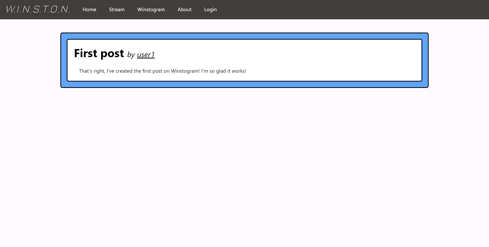
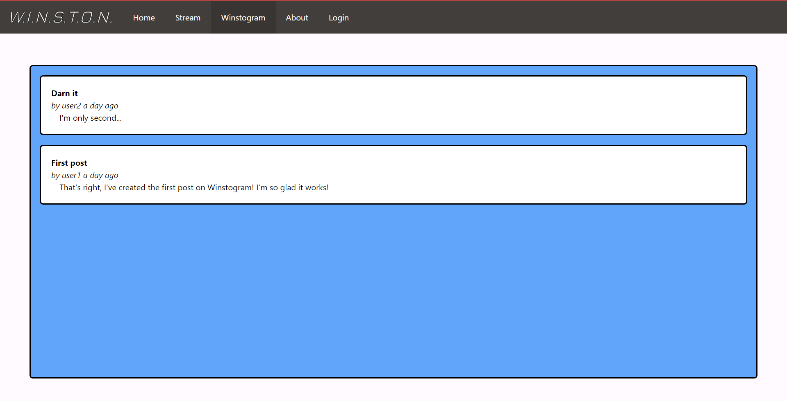
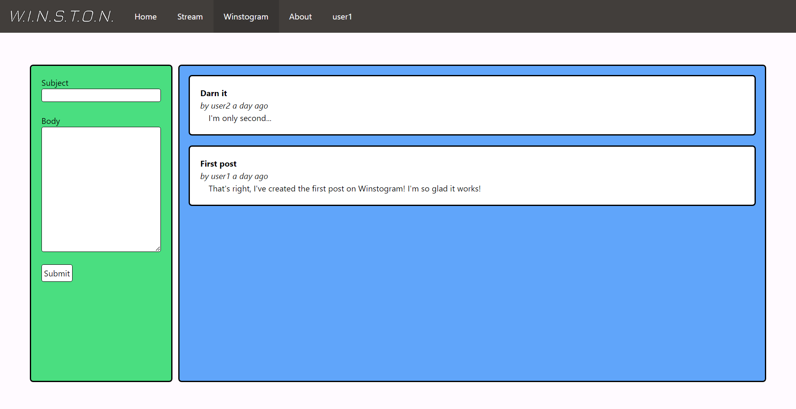
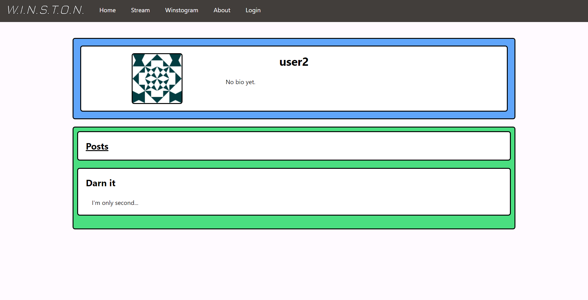
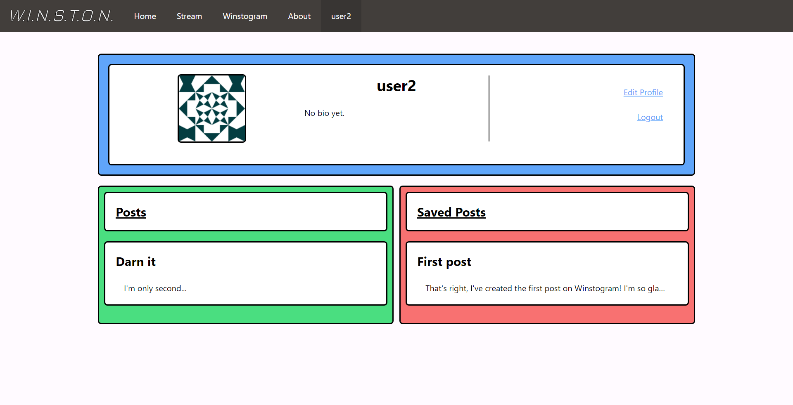

[Morgan's Blog](https://Morgan-Potter.github.io)

[Sam's Blog](https://samsidebotham.com)

[GitHub Repository - Winston](https://github.com/joush007/WINSTON) - All parts of the project are linked through submodules

# Overview

Over the week, there were many things that I had to fix up for the website before submission (as it was due on Monday night). I had to fix up the collections, as they weren't working properly, and I had to update the look o fthe website to make it more appealing to the average user. I also had to fix up a bit of the database to get it working properly.

# Collections

The collections for the database was an integral part of the site, allowing for users to save posts that they can then view later. The issue I had beforehand was to do with the save button on the posts, and the way that you view posts. The main issue was that, if it the site was designed for forums, then the website did not do its job very well, as this was desgned for short posts and messages as if it were a social media like Twitter.

My solution was simple, implement a new page that will show the whole post and only display a shortened version of the post if it is too long. Luckily for me there is an easy way to implement this in Tailwind CSS. To display a shortened version of the post, I can use the `truncate` class, which will cut off the text after it reaches max-width and then add an ellipsis to the end of the text.

```html
... 
<a href="{{ url_for('winstogram', id=post.id) }}">
    <div class="outline bg-accent rounded p-5" id="{{ post.id }}">
        <div class="truncate" id="header">
            
            <b>{{ post.header }}</b>
            <br /><i
                >by {{ post.author }} {{ moment(post.timestamp).fromNow() }}</i
            >
            
        </div>
        <div class="px-4 truncate" id="body">
             {{ post.body }} 
        </div>
    </div>
</a>
<br />
 ...
```

[As can be seen, in both the header and body there is a truncate in case the post is too long.]

Next we made the new page for the post, which has been mentioned in the code snippet above earlier as the `href` for the `<a>` was `url_for('winstogram', id=post.id)`, which takes you to the posts page with the parameter for the id of the post. The new page will then only show you the one post, as it has been coded in that if the `id` is specified, it will show a different page.

```python
if id:
    return render_template(
        'post.html',
        title='Post',
        post=Post.query.get(id),
        author=User.query.get(Post.query.get(id).user_id),
        current_user=current_user,
        app=app,
    )
```

As you can see it's pretty self explanatory.

The actual html looks like this to display the page:

```html
 

<div class="w-full">
    <div
        class="lg:w-[60rem] xl:w-[72rem] mx-auto outline rounded bg-blue-400 p-5"
        id="postContainer"
    >
        <div class="outline rounded bg-accent p-5">
            <div id="header">
                <h2 class="text-4xl">
                    <b>{{ post.header }}</b>
                    <i class="text-2xl"
                        >by
                        <a
                            href="{{ url_for('user', id=post.author.id )}}"
                            class="underline"
                            >{{ post.author.username }}</a
                        ></i
                    >
                    <i class="opacity-50 text-xl" id="saveButtonItalics">
                         
                        <form
                            action="{{ url_for('save_post', id=post.id) }}"
                            method="post"
                            novalidate
                        >
                            {{ form.hidden_tag() }} {{ form.save() }}  
                        </form>
                    </i>
                </h2>
            </div>
            <br />
            <div class="px-4" id="body">{{ post.body }}</div>
        </div>
    </div>
</div>

```

NOTE: You don't need to worry about all the classes specified in this snippet.

Output:


The other thing that will show, which isn't being shown at the moment is the save button, which will allow you to save the post to your profile's saved posts. This is done by a simple form that will send a POST request to the server, which will then add the post to the user's collection.

# Update Look

The second largest change was a change to the front end of the page, as can be partially seen in the post image. The change brought about major UI updates which made the site a lot more user friendly and easy to look at. The pages which changed the most are the Posts page and the Profile page, but most pages got a small makeover with switching to a grid format and using a few different colours.

## Posts Page

I had been looking at fixing the posts page for a while now, as it just didn't sit right with the post form (where you post something new) on the left and the individual posts on the right. The previous template I used removed the form if you weren't logged in, but left a blank space in its place. With the new format, I went from that to an expanded posts section taking up the space where the form would be if you're logged out.

When you're logged out:


When you're logged in:


This crossed with the new colours greatly enhances the approachability of the website making it seem a bit less serious and a bit more playful and fun, which is what I initially wanted to go for.

## Profile Page

The profile page was also looking a bit sad earlier, only showing the username and profile picture of a specified user. The page looked quite empty and showed little that was useful about the user. The new profile page includes the username and profile picture of the user, a bio, all of the users posts. If you're viewing your own page, it will also display the buttons to logout and edit your profile as well as all of your saved posts. The page looks like this:

When logged out:


When logged in:


All in all, I believe that each of these additions to the site (as well as the other smaller ones) have proven to be quite effective in reaching for the feel for the site that I'm trying to reach. Although I'm not great at front end, I was in dire need of changing it up and at least trying to make it look a bit better than it did before.

# Database

The last major thing I updated was the database and a singular parameter that ran across multiple of the tables. The parameter was in the `lazy` parameter that was specified in a few column relationships. This would allow joining the table to be easier with SQLAlchemy methods, but in my case, I needed to access it through the admin page when inspecting an entry, and it was deciding to cause issues, as when I displayed it, it would instead show an SQL statement (not what I wanted). Therefore I removed it, and all my problems went away. 

That was a lie. It took me another ~5 hours to fix the other issues that came up because of this, but it was all better in the long run.

# Conclusion
In conclusion: "Errors are bad" [(myloadtest, 2012)](https://www.myloadtest.com/blog/errors-are-bad/).
I'm sorry, I couldn't resist after I spent 5 hours on errors with the database.

Anyway, I have gotten a lot done on the website and I'm quite pleased at the result. A lot of time and effort has been put into making sure that the website functions and looks good, and I believe that I am over halfway to achieving just what it is I'm planning to do with the site. I will continue to work on it in the future, but this is my last post of the semester, and so posts will start picking up again in the next semester.

| To Do                                                                                       | Done |
| ------------------------------------------------------------------------------------------- | ---- |
| Figure out connection method for W.I.N.S.T.O.N.                                             |      |
| Setup connection to W.I.N.S.T.O.N. to allow data flow for CV                                |      |
| Setup a python flask server                                                                 | x    |
| Create a Home Page                                                                          | x    |
| Create Users (with Username, Password [Hashed] and Avatar)                                  | x    |
| Add admin page (For anything that might need to be sent to or from W.I.N.S.T.O.N. directly) | x    |
| Create Profile pages (Ideas to what to add for Users will add here)                         | x    |
| Add user collections                                                                        | /x   |
| Create a W.I.N.S.T.O.N. page where the render will be streamed                              | x    |
| Display live stream                                                                         |      |
| Setup Database Structure                                                                    | x    |
| Add Users and Posts tables to DB                                                            | x    |
| Any other ideas will be added to the table if this changes                                  |      |
