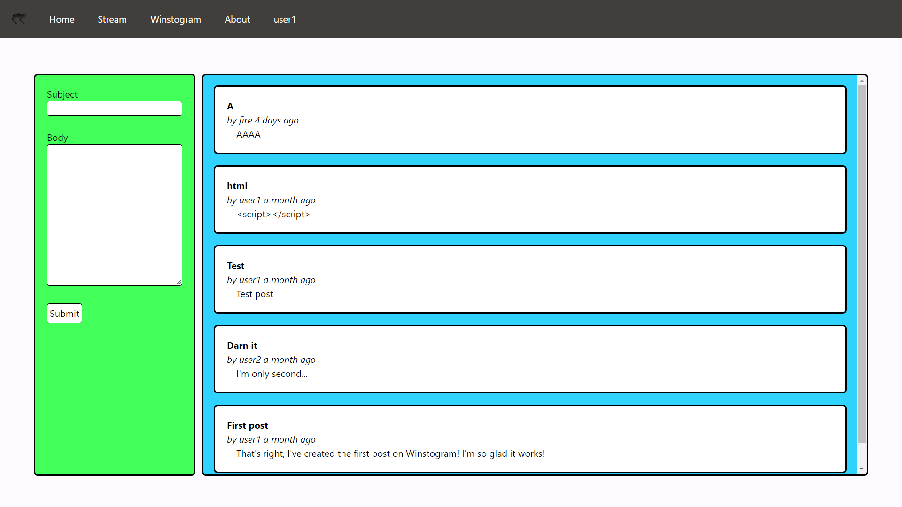
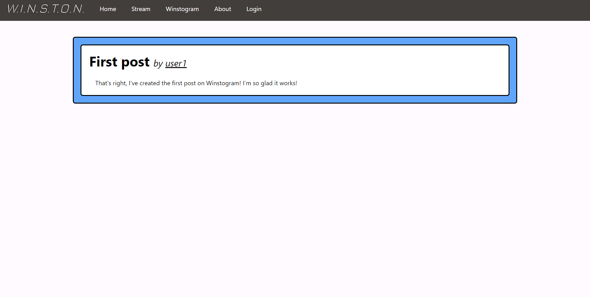
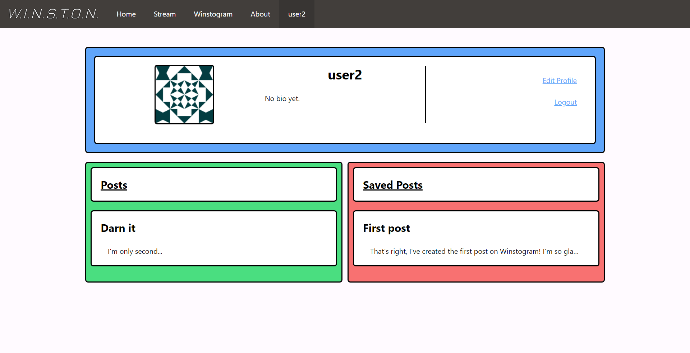
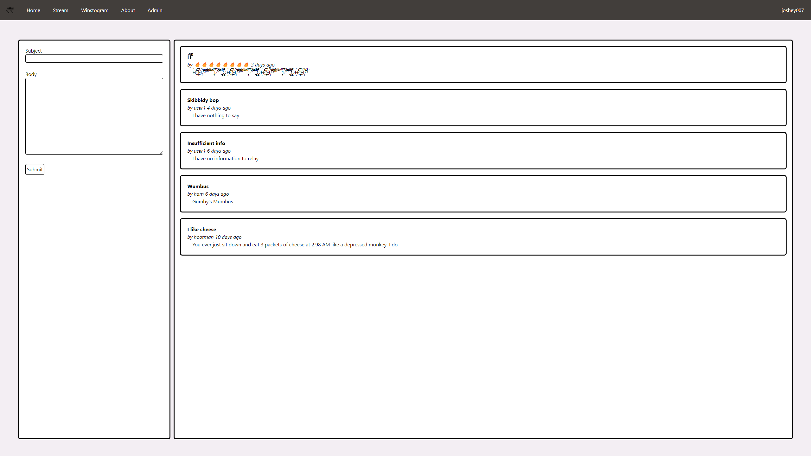
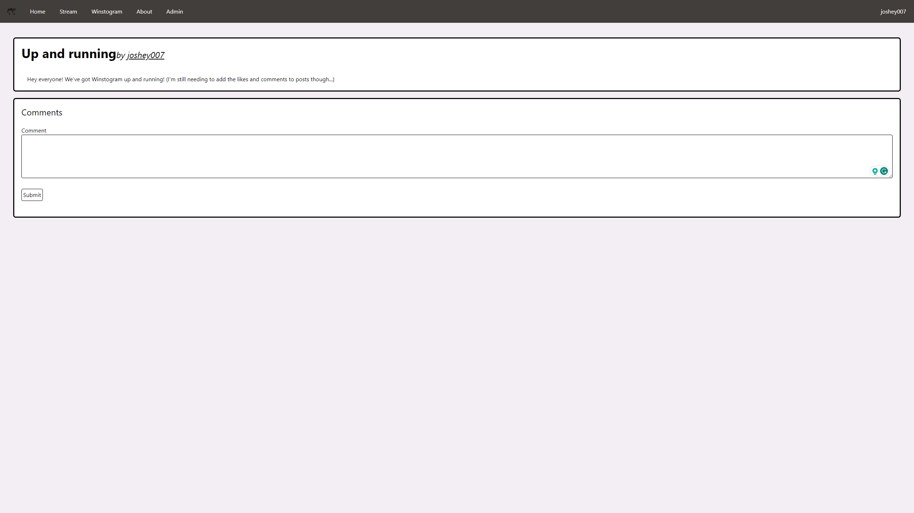
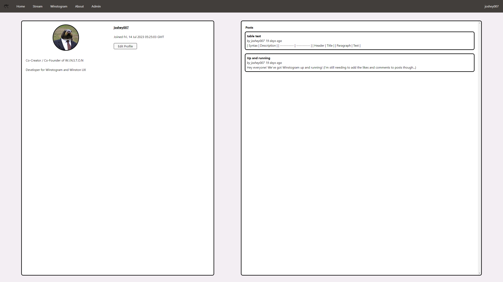

[Morgan's Blog](https://Morgan-Potter.github.io)

[Sam's Blog](https://samsidebotham.com)

[GitHub Repository - Winston](https://github.com/joush007/WINSTON) - All parts of the project are linked through submodules

# Overview

Over the last week I have spent a lot of time working on the way the website looks to make it not so hideous and painful to look at. On top of that, I realised that I had previously put a placeholder for a `Forgot Password` feature, but never actually implemented it. So I implemented that too. I have come to realise, after both working on the site, and from the comments that I have received from other people when they test a feature for me, that the site is not very pleasant to look at. Yes, it may function how I want it to, but I am by no means a front-end developer, and for good reason. Anyway, here's a more in depth explanation of what happened throughout the week.

## Update Looks

It was a necessity to make the site look nicer, as, although it was usable, it wasn't the greatest to look at or use. I think that it was just all over the place, with different colours and layouts that didn't mix with each other and it was just difficult to look at, and so, although the updated version isn't perfect and designed by a professional, I will look into talking with someone who could help me design a theme that I could implement and have across all pages.

Previous pages:





New pages:





A decent chunk of the site has changed, but also not too much at the same time. The major things that can be seen to have changed include:

-   The colour scheme - Removed the bright colours and desaturated it so that other colours can be used in the future
-   The layout - The layout has been changed across the post and user page, with a new, more efficient layout for the user page, which is compatible with mobile, and the post page having a new comment section
-   There is more in the background that has changed but I don't want to overload you with images

The change took a few days to get right, as I was still implementing the JavaScript API calls in the background, and so, with the user page at least, there was a lot of bug fixing to make sure that all of the data was being displayed correctly and in the right location. There was an issue at one point, which I had the audacity not to take a screenshot of, that left a post, as shown in the user page, with the body displayed seperately to the post, therefore you would have the post box with a header and then the end of the box. Below the box would then have the body, which would also be in it's own box. Turns out, this was an issue with my implementation of the posts rendering.

The issue stemmed from the implementation of posts rendering on the user page through a method which would use `innerHTML = ...` for a div. It looked like this previously:

```js
var temp = `<a href="{{ url_for('winstogram')}}/${post.id}">
                <div class="outline bg-accent rounded p-5" id="${
                    post.id
                }">
                    <div class="truncate" id="header">
                        
                        <b>${post.header}</b>
                        <br /><i
                        >by ${post.username}
                        ${moment(post.timestamp).fromNow()}</i
                        >
                        
                    </div>
                    <div class="px-4 truncate" id="body">
                        ${marked.parse(
                            post.body.replaceAll("\n", " "),
                            {
                                mangle: false,
                                headerIds: false,
                            }
                        )}
                    </div>
                </div>
            </a>
            <br>`;
document.getElementById("postsContainer").innerHTML += temp;
```

I had found, that in other circumstances, this would work, but with the new implementation of the user page, it started to break. After a few attempted fixes, I found that I was using the wrong method of editing the DOM, as there is a better method that is used widely to edit the DOM in a better way, and although it's longer, it tends to be more reliable:

```js
a = document.createElement('a');
a.id = post.id;
a.href = `{{ url_for('winstogram')}}/${post.id}`;
a.className =
    'min-w-[calc(100%-2.5rem)] max-w-[calc(100%-2.5rem)] mx-5 my-3 p-2 outline w-full rounded-md bg-accent';

header = document.createElement('span');
header.id = 'header';
header.className = 'truncate block';
header.innerHTML = `<b>${post.header}</b>`;
a.appendChild(header);

author = document.createElement('span');
author.id = 'author';
author.className = 'truncate block';
author.innerHTML = `<i>by ${post.username} ${moment(
    post.timestamp
).fromNow()}</i>`;
a.appendChild(author);

body = document.createElement('span');
body.id = 'body';
body.className = 'truncate block';
body.innerHTML = marked.parse(post.body.replaceAll('\n', ' '), {
    mangle: false,
    headerIds: false,
});
a.appendChild(body);

document.getElementById('posts').appendChild(a);
```

Through this bug, I re-learnt the importance of the proper methods of doing things instead of attempting to use shortcuts.

## Forgot Password
I am unsure of when I added the placeholder for the forgot password button, but I realised recently that I never implemented such a crucial feature to the site, and so, in pursuit of people not losing their profiles by forgetting their password, I decided to implement it. It wasn't too difficult to implement, as I have looked into it in the past through [Miguel Grinberg's Flask Mega Tutorial](https://blog.miguelgrinberg.com/post/the-flask-mega-tutorial-part-x-email-support), but I had forgotten some of the big issues that came with it, mostly those being trying to connect to the mail server, where the issue wasn't even related to being unable to connect to the servers from bad code implementation.

The first thing I did when looking into this, was to create a new page on the site for the user to enter their email address so that a link to reset the password could be sent to them. This wasn't a complex page, and was as simple as the login page, but with just a single input box for the email address. The page code can look like this:

```html
 

Forgot Password


<h1 class="text-5xl">Forgot Password</h1>
<br />
<form action="" method="post" class="" novalidate>
    {{ form.hidden_tag() }}
    <p>
        {{ form.email.label }} <br />
        {{ form.email(size=32, class_="border border-black rounded") }}
        
        <span class="text-red-500">[{{error}}]</span>
        
    </p>
    <br />
    <p>
        {{ form.submit(class_="border p-1 border-black rounded
        bg-accent") }}
    </p>
</form>

```

The page, just like the rest of them, uses Jinja2 templating to display the form, and other than that has an open page.

This would then have to link back to `routes.py` in it's own function:

```py
@app.route('/forgot_password', methods=["GET", "POST"])
def forgot_password():
    # If the user's logged in, it shouldn't matter
    if current_user.is_authenticated:
        return redirect(url_for('index'))

    form = ForgotPasswordForm()
    if form.validate_on_submit():

        user = User.query.filter_by(email=form.email.data).first()

        if not user:
            flash("No user found with that email")
            return redirect(url_for('forgot_password'))
        
        send_password_reset_email(user)
        flash("Password reset email sent!")
        return redirect(url_for('login'))

    return render_template(
        'forgot_password.html',
        title='Forgot Password',
        app=app,
        form=form
    )
```

This would link everything together that needs to be combined to get the form working, including the form itself,

```py
class ForgotPasswordForm(FlaskForm):
    email = StringField('Email', validators=[
                        DataRequired(), Email("Email must be valid"), Length(5, 128, "Email must be at least 5 characters long")])
    submit = SubmitField("Submit")
```

After the page is viewed, it will send a password reset email to the user, which is done through the `send_password_reset_email` function. It will create a token with an expiry time for security reasons, and will allow a user to reset their password. This required creating `email.py`, which holds all of the functions relating to sending emails, and is imported into `routes.py` to be used. The code for the function is as follows:

```py
from threading import Thread

from flask import render_template
from flask_mail import Message

from app import app, mail

def send_async_email(app, msg):
    with app.app_context():
        mail.send(msg)

def send_email(subject, sender, recipients, text_body, html_body):
    msg = Message(subject, sender=sender, recipients=recipients)
    msg.body = text_body
    msg.html = html_body
    Thread(target=send_async_email, args=(app, msg)).start()

def send_password_reset_email(user):
    token = user.get_reset_password_token()
    send_email('[Winstogram] Reset Your Password',
               sender=app.config['ADMINS'][0],
               recipients=[user.email],
               text_body=render_template('email/reset_password.txt',
                                         user=user, token=token),
               html_body=render_template('email/reset_password.html',
                                         user=user, token=token))
```

The reason the page looks like this, is that we want to send emails asynchronously, or, in the background so that other processes can run at the same time. To do this, we created `send_async_email` which is referenced in `send_email`. This is then called in `send_password_reset_email` which takes in the user, and sends them an email with the token in a nicely formatted message, which is rendered through Jinja.

HTML:
```html
<p>Dear {{ user.username }},</p>
<p>
    To reset your password
    <a href="{{ url_for('reset_password', token=token, _external=True) }}">
        click here
    </a>.
</p>
<p>Alternatively, you can paste the following link in your browser's address bar:</p>
<p>{{ url_for('reset_password', token=token, _external=True) }}</p>
<p>If you have not requested a password reset simply ignore this message.</p>
<p>Sincerely,</p>
<p>Winston (That's right, a robot dog sent you this email)</p>
```

txt:
```txt
Dear {{ user.username }},

To reset your password click on the following link:

{{ url_for('reset_password', token=token, _external=True) }}

If you have not requested a password reset simply ignore this message.

Sincerely,

Winston (That's right, a robot dog sent you this email)
```

The email links to the `reset_password` function, with the token as a parameter to verify the user. This function is located in `routes.py`:

```py
@app.route('/reset_password/<token>', methods=['GET', 'POST'])
def reset_password(token):
    # If the user's logged in, it shouldn't matter
    if current_user.is_authenticated:
        return redirect(url_for('index'))
    
    # Verify the token
    user = User.verify_reset_password_token(token)
    if not user:
        # if the token is wrong, you can't reset
        return redirect(url_for('index'))

    # If the token is valid, reset the password
    form = ResetPasswordForm()
    if form.validate_on_submit():
        user.set_password(form.password.data)
        db.session.commit()
        flash('Your password has been reset.')
        return redirect(url_for('login'))
    return render_template('reset_password.html', form=form)
```

The function verifies the token, and then, if it's valid, allows the user to reset their password with another form. This form contains two password fields, and a submit button, and is almost identical to the registration form's password fields:

```py
class ResetPasswordForm(FlaskForm):
    password = PasswordField('Password', validators=[
                             DataRequired(), Length(8, 32, "Password must be between 8 and 32 characters long")])
    password2 = PasswordField(
        'Repeat Password', validators=[DataRequired(),
                                       EqualTo('password'), Length(8, 32)])
    submit = SubmitField('Reset Password')
```

On submit, it will set the user's password to the new one, and redirect them back to the login page so that they can log back in again.

# Conclusion

I know.. that was a lot of code. I mainly focused on these implementations this week, and got not much, if anything done on data science this week, especially as PyCon is less than a week away. Therefore I have been utilising my time to get as much done on the website as I can to get a good functionality to present at the conference.

The implementations that I've looked into this week have been very useful in my development journey as it's taught me new ways to look at problems, and also the value of using the proper methods for doing specific tasks, as it will allow for expansion and scalability in the future. I'm looking forward to continuing to work on the website, and hopefully get it to a point where I can have it ready to go for public viewing, although that may still be a month or 2 away. Next week, I will continue to work on the site, and also after PyCon, but it's exciting and stressful having the conference so close, but I'm still looking forward to it with the boys.