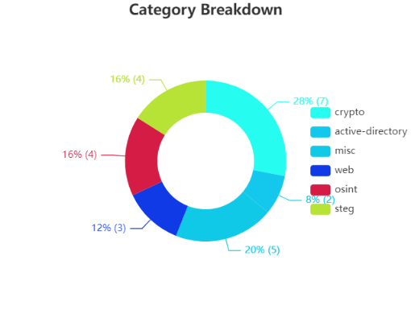
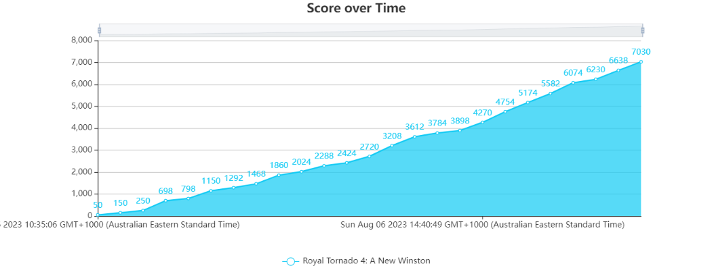

# PeCan+ 2023
As you guys know, PeCan+ is a cool cyber security competition that is hosted every year for high school students. Last week myself, Sam, Morgan and Michael decided to take part. The day took on the same format as last year, with a training day on the first day and the competition on the second. The training day was useful if you were new to cyber security, as it taught useful information on how to use the tools that we could use, such as exiftools for metadata, steghide for stegonography and general Linux use. As this was the second time we'd been, we payed attention to the training, but realised we knew a decent chunk of it already, and so we focused on solving the 2023 challenge coin, as I went through in a previous post.

## The Competition
The competition was nice and eventful, except for the fact that it started a bit earlier than we were expecting. There is the old '5 P' saying: 'Prior Planning Prevents Poor Peformance', and it was proven to us as we had turned up around 30 minutes late. The main reason we were late was due to being told previously when it started, but then we learnt that we misinterpreted the start time as almost the entire team turned up 30 minutes late... *whoops*.

(Our Team)[https://ctf.ecusri.org/users/204]

Apart from that, the competition went by quickly, with challenges from all of the categories being approached. Our strength seemed to lay the most in crypto, getting 7 questions solved, which was followed closely with osint (4) and steg (4). I'm not going into how we got everything as there are many write ups already for the challenge in the discord and online. 

Another positive of the competition was that I was able to get more experience in cyber security and connect with some new people in the cyber security industry. I was able to talk to a few people from Ionize who were really nice to talk to and had a lot of experience that they could teach and could talk about their experiences in the industry.

## The Results

Overall we came 7th in the competition and 3rd in our division, but at least we had some fun.

