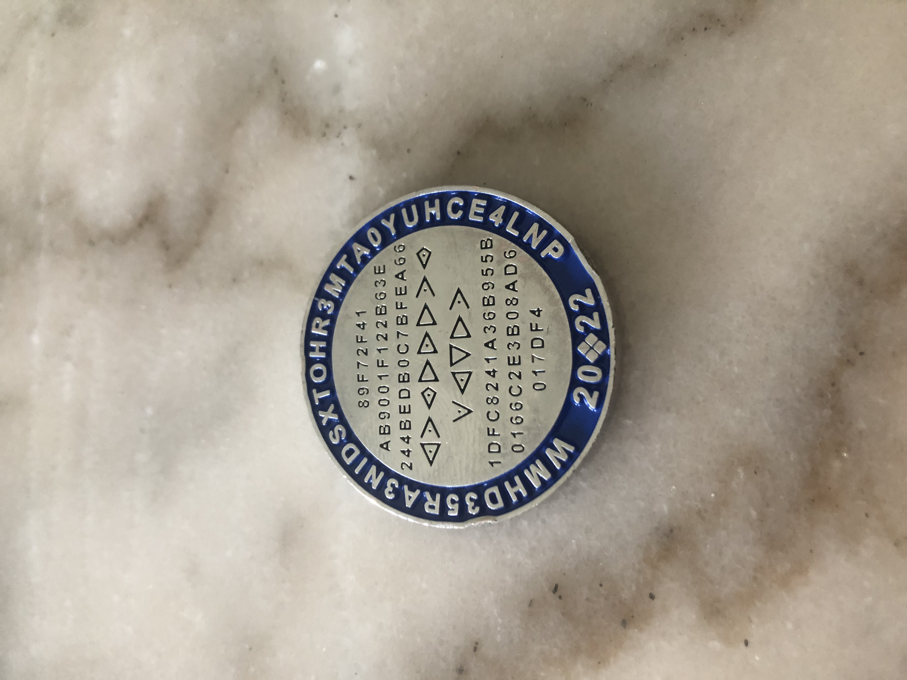
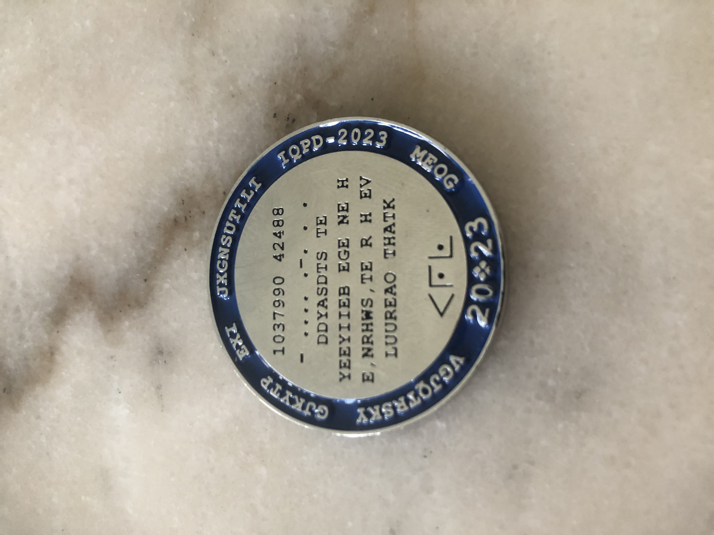

Firstly, I'd like to say that this post will be shorter than usual, as I will be explaining some of the ways that we solved the challenge coins, but will not be as much of an explanation as to the actual PeCan+ challenges and solution, which can instead be found [here](https://github.com/ECUComputingAndSecurity/PECANCTF-2023-Public)!

# PeCan+ 2023

Over the weekend, Sam, Morgan, Michael and I competed in PeCan+ 2023, alongside a few other teams from the same school and many other teams across Australia. Overall we came 3rd in the beginner division and 7th overall in Australia.

PeCan+ went for 2 days, where the first day was a training day and the second was the actual competition. On the first day we were going through a few of the different topics and getting an overview how to use Linux as well. We got brief overviews on how to approach Cryptography, Forensics, Stegonography and a few more, and it was quite nice to learn, but we weren't solely focused on it. The main focus for the team was on the new challenge coin for 2023.

## Challenge Coin

### Before I go any further, if you are looking to solve the challenge coin yourself, please skip this post.
So, anyway, here's what happened. We were given both challenge coins recently, the 2022 and the 2024 coins. There was, however, a different methodology to solve each of them.

2022 Coin:


2023 Coin:


## 2022 Coin

The coins are both quite similar in looks, but the challenge itself differs between the 2. To solve the first coin was challenging, but not too challenging so as to discourage trying, and here's how we solved it.

Firstly, we need to get all the information in one place, and so we wrote it all down on a file to keep track of. Here's what we start with:

Outside: 

`WMHD35RA3NIDSXTOHR3MTA0YUHCEALNP`

Inside:
```
    89F72F41
 AB9001F122B63E
244BEDB0C7BFEA66

 Templar Cipher

1DFC8241A36B955B
 01BBC2E3B08AD6
     017DFA
```

Steps to Success:
1. Identify that the code in the middle is a Templar Cipher and decode it. This would give us a clue to the outside of the coin saying `TRY EVERY OTHER`.

2. Apply this hint to the outside of the coin to get 2 phrases:
    * `MD5 AND XOR MAY HELP`
    * `WH3R3 IS TH3 T0UC4N`

3. Ask: How long is the code above and below the Cipher because we might be able to perform an `MD5` decryption using the key `WH3R3 IS TH3 T0UC4N` and then XOR the result with the code above the Cipher to get the code below the Cipher.

4. Realise that is not the correct solution, as A) the code is not the right length for `MD5` and B) It doesn't give anything useful

5. Ask: What if instead of decrypting with `WH3R3 IS TH3 T0UC4N`, we encrypt it using `MD5`

6. I'll let you figure out the last step, mostly because I didn't figure it out myself, sorry, but also because it is a little problem solving challenge for you.

## 2023 Coin

Solving the coin, we needed to do the same thing, first getting the information:

Outside:

`VGJQTRSKY GJKYTP EXI JXGNSUTILI IQPD-2023 MEOG`

Inside:

```

  1037990 42488
 
  - .... .-. . .
  
   DDYASDTS TE
YEEYIIEB EGE NE H
E,NRHWS,TE R H EV
  LUUREAO THATK

      Cipher
```

Steps to Success:

1. Identify the codes in the middle:
    * `1037990 42488` is most likely a long/lat position, but something isn't right about it.
    * `- .... .-. . .` is morse code for `THREE`
    * `DDYASDTS TE YEEYIIEB EGE NE H E,NRHWS,TE R H EV LUUREAO THATK` is a cipher of some kind
    * The Cipher down the bottom translates to `URL`

2. Find the location of the coordinates, the code THREE can be used to decode the rail fence cipher for `DDYASDTS TE YEEYIIEB EGE NE H E,NRHWS,TE R H EV LUUREAO THATK`, which will give us `Divide by leagues under the sea, north west, they are the key`.

3. Ask: What is leagues under the sea? Turns out it's a movie, `20,000 leagues under the sea`.

4. Divide the first numbers by 20,000, and we'll get our long/lat: `51.8995 2.1244`. This is in the sea just off of the UK.

5. What's `north west` of the location? Turns out a government office GCHQ

6. Plug this in as the key to a Vigenere Cipher and we'll get `PECANPLUS ECUSRI ORG CHALLENGES COIN-2023 GCHQ`.

7. Use our last clue `URL` and go to the site. 

Congratulations! You've now completed the challenge coin for 2023.

## Conclusion

Sorry for a shorter post this week, but it was still interesting to solve the coins. Sadly, the 2023 coin could be solved a lot easier than following the clues. Instead, you could brute force the outside and get the answer almost immediately, which is a bit of a shame as we thought it was one of the early layers and tried it *whoops*. Anyway, I hope you get the chance to attempt to solve coins yourself and any other ones that you get the chance to look into yourself (and if you really want to challenge yourself, solve the `ASD` coin from last year).

As usual, I'll post again next week on the progress of everything!