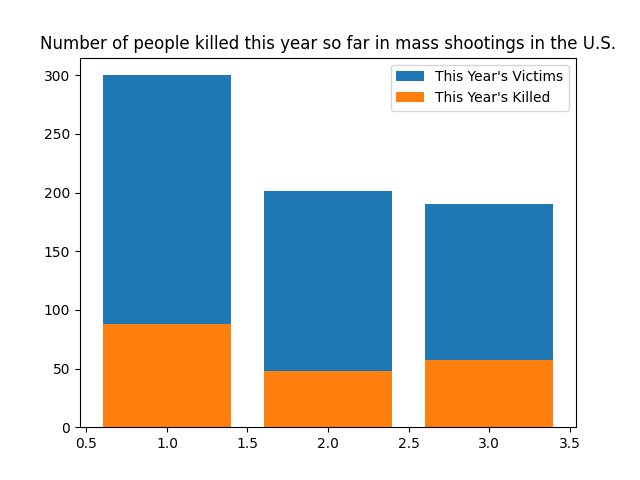
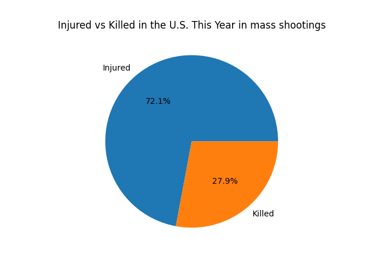
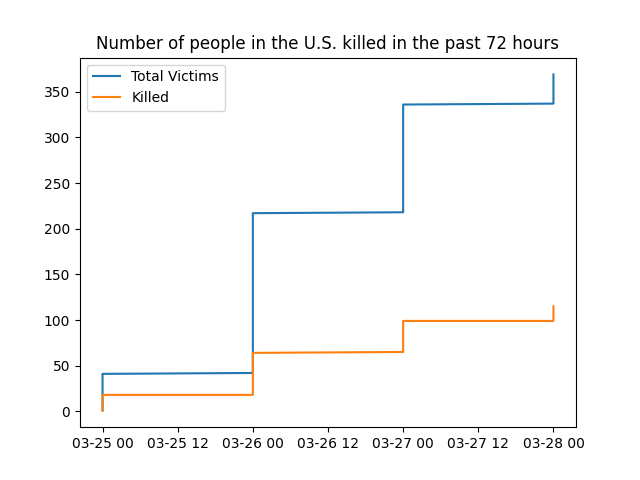
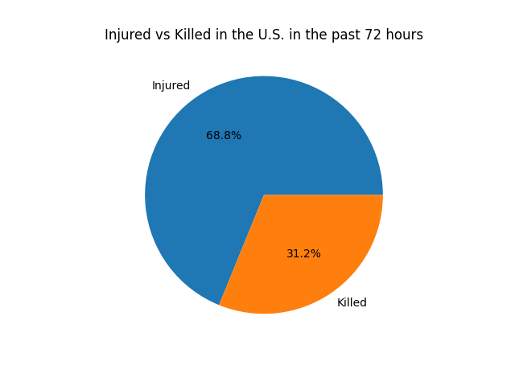

## Introduction
On the night of the 28th I was watching the news when I had seen about another mass shooting in the U.S. in Nashville, Tennessee. I was then educated to the fact that this was the 135th mass shooting in the U.S. this year, meaning there have been more mass shootings in the U.S. this year than days, which is quite shocking to think about.

To put that in perspective, that means that (as of the 28th) there would've had to have been about 3 mass shootings every 2 days to reach the 135 total.

This was crazy, so I decided to look into the data a bit more to get a better understanding of what was going on. The way it was shown previously on the [gun violence archive](https://www.gunviolencearchive.org/) was a bit confusing, being shown as individual rows to show each data entry, but I needed to see it a bit more clearly, and so I decided to use Python to make it a bit more readable.

## Data acquisition
The data was taken from the [gun violence archive](https://www.gunviolencearchive.org/) and was downloaded as a CSV file. I used both data from mass shootings (of all time), data from this year for all shootings and over a 72 hour period before the 29th (25th-28th) and data for the mass shootings of just this year, It should be noted that I hadn't actually used the data of mass shootings for all time for this.

## Data visualisation and analysis
Grabbing the data was alright in itself, but until I do something with it, it's kind of useless, so next I had to write some python using the `Pandas`, `Numpy` and `Matplotlib` libraries to visualise the data.

This post isn't necessarily about the code, but I will still show it so you can reproduce it yourself if you want to.

```py
import pandas as pd
import numpy as np
import matplotlib.pyplot as plt


# Read in the data
df1 = pd.read_csv('./ThisYear.csv')
df2 = pd.read_csv('./Last72Hours.csv')

print(df1.head())
print(df2.head())

# Dates look like: March 28, 2023
# Convert to datetime
df1["Incident Date"] = pd.to_datetime(df1["Incident Date"])
df2["Incident Date"] = pd.to_datetime(df2["Incident Date"])

df1["Total Victims"] = df1.apply(lambda row: row["# Killed"] + row["# Injured"], axis=1)
df2["Total Victims"] = df2.apply(lambda row: row["# Killed"] + row["# Injured"], axis=1)

# Group by month and bar graph
df1month = df1.groupby(df1["Incident Date"].dt.month).sum()
df2month = df2.groupby(df2["Incident Date"].dt.month).sum()

# Bar graph of total victims and killed for this year
plt.figure()
plt.bar(df1month.index, df1month["Total Victims"], label="This Year's Victims")
plt.bar(df1month.index, df1month["# Killed"], label="This Year's Killed")
plt.title("Number of people killed this year so far in mass shootings in the U.S.")
plt.legend()
plt.savefig("killed_this_year_so_far_mass_shootings.png")

# Pie graph, how many killed and injured % wise
plt.figure()
plt.pie(df1[["# Injured", "# Killed"]].sum(), labels=["Injured", "Killed"], autopct='%1.1f%%')
plt.title("Injured vs Killed in the U.S. This Year in mass shootings")
plt.savefig("Injured_vs_Killed_this_year_mass_shootings_pie.png")

# line graph of total victims and killed for last 72 hours (show accumulative total over time)
plt.figure()
plt.plot(df2["Incident Date"], df2["Total Victims"].cumsum()[::-1], label="Total Victims")
plt.plot(df2["Incident Date"], df2["# Killed"].cumsum()[::-1], label="Killed")
plt.title("Number of people in the U.S. killed in the past 72 hours")
plt.legend()
plt.savefig("killed_last_72_hours.png")

# Pie graph to show the distribution of the number of people killed in the past 72 hours
plt.figure()
plt.pie(df2[["# Injured", "# Killed"]].sum(), labels=["Injured", "Killed"], autopct='%1.1f%%')
plt.title("Injured vs Killed in the U.S. in the past 72 hours")
plt.savefig("Injured_vs_Killed_last_72_hours_pie.png")

plt.show()
```

This script produces four graphs, a bar graph to show the number of people killed this year so far in mass shootings in the U.S., a linking pie graph to show the percentage of people killed vs injured in the U.S. this year in mass shootings, a line graph to show the number of people killed in the past 72 hours and a linking pie graph to show the percentage of people killed vs injured in the U.S. in the past 72 hours. The 2 pie graphs are used to get a better understanding of the distribution of the data with who is killed and injured.

## Analysis
The first graph shows the number of people killed this year so far in mass shootings in the U.S. and we can see that there is a large proportion of people shot in mass shootings in January alone, seeming to have the highest number so far. This is interesting to look at when you take into account that there are about 700 people that have been shot in total up to the 28th of March, with almost half of them occurring in January alone. On top of that, we can see that the graph evens out for the next two months, with around 200 people being shot during these shootings in February and March, which will hopefully continue to be the case.

It is important to inquire into the reason behind the large number of shootings in January. There isn't a clear reason with this data alone, but if we were to dig into some other correlated data, we could uncover the reason as to why there are so many at the very start of the year, which I'd assume is to do with the fact that it's a big event moving into a new year, but I'm unsure how that would directly correlate or if it would correlate at all.



On top of that we can note the number of people who had been killed compared to those that had just been injured during these shootings (as those who were involved but not injured or killed weren't included in the data). This is shown from the pie chart comparing the two. It is clear to see that there is about a 3:1 ratio of people who were injured to those who were killed, which is interesting to note, showing that there is a majority of people who are injured in these shootings, but not killed, and is even more interesting when compared to the other pie graph, which is referencing data from all shootings in a 72 hour time period (not necessarily mass shootings), which shows a bump in the percentage from ~28% to ~31%, noting a 3% bump in the number of people killed, possibly linked to a direct or indirect target from the shooter.



Now we've got a better understanding of the mass shootings this year, we can have a look into the shootings that happened (between the 25th and 28th) and how they accumulated each day (NOTE: The dates didn't show at the bottom, so they show the date in MM-DD HH).

The most obvious jump in the data can be seen on the 26th, with around a 170 person jump in the number of injuries in a day. It's notable that in total there was an accumulation of around 370 people injured and 115 people killed over the 72 hour period. The data consists of many smaller shootings compared to the other data containing a smaller number of shootings with a greater amount of people injured or killed in each of them.



The distribution is a bit different in the second graph, showing the victims of smaller shootings, with a bump in the number of people killed by about 3%, which is interesting to note, as it makes sense that with a smaller shooting, there would be a greater focus on a singular target, increasing the chance that they will succeed with what they're trying to do instead of focusing on everyone like in a mass shooting.



## Conclusion
In conclusion, a lot of information can be extracted from this data, really highlighting the effect that these shootings can have and how much they can affect a community. We have noted that there were around 370 people shot in a 72 hour time period, that's just half of the amount of people that have been involved in a mass shooting this year, with around 700 people. In this case it's pretty safe to assume that whilst we look into the mass shootings, it's only showing a small amount of the overall casualties, as there is still a lot happening outside of mass shootings, those being just smaller shootings that there are a lot more of in a shorter time period, leading to an overall higher number of casualties.