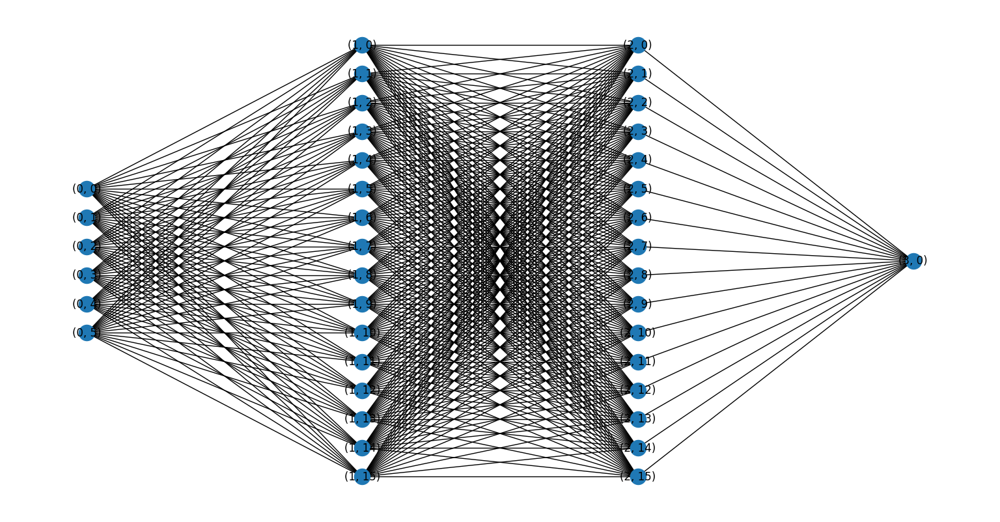

[ANN Implementation](https://github.com/joush007/artificial-neural-network)

# Overview
I had my first encounter in implementing an artificial neural network (ANN) in python. I first found a tutorial online to build a [simple ANN](https://medium.com/@hadican/how-to-build-a-simple-artificial-neural-network-ann-a064939f940b) and then built on top of it to create a more complex ANN. I went from having a singular layer to modify data into a more complex ANN with a variable number of layers and nodes. Finally I created a version of the class which would have an inbuilt method to visualise the ANN.

# Main Content
The [first version](https://github.com/joush007/artificial-neural-network/blob/master/v1_main.py) was a simple ANN with a single layer. It would take in a set of inputs and run it through a bunch of connections which would modify the data and output a single value. It took in a set of inputs that looked like this:

| Input 1 | Input 2 | Input 3 | Output |
| ------- | ------- | ------- | ------ |
| 0       | 1       | 1       | 0      |
| 1       | 1       | 0       | 1      |
| 1       | 0       | 0       | 1      |
| 0       | 1       | 1       | ?      |

What we can recognise is that Input 2 and 3 are actually irellevant to the output, and that the output is the same as Input 1. A machine will not recognise this as easily and so I needed to create training data and train a machine learning model to recognise this pattern. To train the model, the weights on the model will need to be adjusted by comparing the output to the training output and adjusting the weights accordingly with their error. To do that you'd need code similar to this:

```py

for _ in range(number_of_iterations):
    # Pass training set through the neural network
    output = self.think(training_inputs)
    error = training_outputs - output
    # Sigmoid is a normal mathematical sigmoid function
    adjustments = np.dot(training_inputs.T, error *
                            self.sigmoid_derivative(output))
    self.synaptic_weights += adjustments

```

This trains the model to recognise it and will change the weights of the connections which will in turn change the output of the model.

The [second version](https://github.com/joush007/artificial-neural-network/blob/master/v2_more_inputs.py) was an attempt to add another layer of neurons to the ANN. This would allow for the ANN to recognise more complex patterns, and although that doesn't mean anything for the use that I had for it, it was there to learn how to implement it for version three. The main change came from the initialisation of the connections and then the training to adjust the weights using back propagation.

```py

def __init__(self) -> None:
    """
    Initializes the ArtificialNeuralNetwork object with random synaptic weights.
    """

    # Syntax: np.random.random((rows, columns))
    # Connect x input neurons to to y output neurons
    self.first_layer_connections = 2 * np.random.random((6, 4)) - 1 # Connects 6 input neurons to 4 hidden neurons
    self.second_layer_connections = 2 * np.random.random((4, 1)) - 1 # Connects 4 hidden neurons to 1 output

...

def think(self, inputs) -> float:
    """
    Computes the dot product of the inputs and synaptic weights, and applies the sigmoid function.

    Parameters
    ----------
    inputs : ndarray
        The input values.

    Returns
    -------
    float
        The output of the neural network.
    """
    inputs = inputs.astype(float)
    # Now we calculate the new output by passing the output of layer 1 into layer 2
    output_1 = self.sigmoid(np.dot(inputs, self.first_layer_connections))
    output_2 = self.sigmoid(np.dot(output_1, self.second_layer_connections))
    return output_2

def train(self, training_inputs: np.ndarray, training_outputs: np.ndarray, number_of_iterations: int) -> None:
    """
    Trains the neural network using the given training inputs and outputs.

    It calculates the error margin by comparing the output to the expected output and adjusts the synapses based on this error margin (back propagation).

    Parameters
    ----------
    training_inputs : ndarray
        The inputs that the model will train with.
    training_outputs : ndarray
        The expected outputs of the model.
    number_of_iterations : int
        The number of training iterations to run.

    Returns
    -------
    None
    """
    for _ in range(number_of_iterations):

        # The output of the first layer is the input of the second layer
        output_1 = self.sigmoid(np.dot(training_inputs, self.first_layer_connections))
        output_2 = self.sigmoid(np.dot(output_1, self.second_layer_connections))
        # Calculate the error for each layer and the Delta (How much each node affects the error)
        error2 = training_outputs - output_2
        delta2 = error2 * self.sigmoid_derivative(output_2)
        error1 = delta2.dot(self.second_layer_connections.T)
        delta1 = error1 * self.sigmoid_derivative(output_1)
        # Calculate the adjustments to the weights
        adjustments1 = np.dot(training_inputs.T, delta1)
        adjustments2 = np.dot(output_1, delta2)
        # Apply the adjustments to the weights
        self.first_layer_connections += adjustments1
        self.second_layer_connections += adjustments2
```

The code comments throughout shows the difference between the two versions, but the main difference is the addition of the second layer and the changes to the training and thinking functions to account for the second layer.

[Version 3](https://github.com/joush007/artificial-neural-network/blob/master/v3_2layers%26visualisation.py) added a modular number of layers. I was thinking of ways to improve it further, and so with version 3 I added a visualise method and a modular number of layers to work with, including the ability to modify the number of inputs and outputs through the constructor. The idea was that I wanted a way to understand what I am working with by being able to see it, and I wanted a way to increase the complexity of the model in the event that I was going to use it in the future for anything more complex.

The main changes that can be seen are here:

```py
def __init__(self, inputs: int = 1, outputs: int = 1) -> None:
    """
    Initializes the ArtificialNeuralNetwork object with random synaptic weights.

    Parameters
    ----------
    inputs : int, optional
        The number of input neurons, by default 1
    outputs : int, optional
        The number of output neurons, by default 1

    Returns
    -------
    None

    """

    # Connects input neurons to output neurons
    self.input_to_output  = 2 * np.random.random((inputs, outputs)) - 1
    self.layers = [self.input_to_output]

def add_layer(self, layer_size: int = 1, layer_position: int = -1) -> None:
    """
    Adds a layer to the neural network.

    Parameters
    ----------
    layer_size : int, optional
        The number of nodes in the layer, by default 1

    layer_position : int, optional
        The position of the layer in the neural network, by default appends to one layer before the output layer

    Returns
    -------
    None
    """
    # Add's a layer to the neural network
    layer = 2 * np.random.random((layer_size, self.layers[-1].shape[1])) - 1

    # If no layer position is given, add layer to the end of the neural network
    if not layer_position: layer_position = len(self.layers)

    while layer_position < 0: layer_position += len(self.layers) + 1

    # adjust size of layer outputs if a next layer exists
    # Insert layer in between two layers, adjust output side
    if layer_position < len(self.layers):

        next_nodes = self.layers[layer_position].shape[1]

        layer = np.resize(layer, (layer_size, next_nodes))

    # adjust input side
    if layer_position != 0 and layer_position <= len(self.layers):
        prev_nodes  = self.layers[layer_position - 1].shape[0]
        while layer_position < 0:
            layer_position += len(self.layers)
        self.layers[layer_position - 1] = np.resize(self.layers[layer_position - 1], (prev_nodes, layer_size))

    self.layers.insert(layer_position, layer)

 def think(self, inputs) -> float:
    """
    Computes the dot product of the inputs and synaptic weights, and applies the sigmoid function.

    Parameters
    ----------
    inputs : ndarray
        The input values.

    Returns
    -------
    float
        The output of the neural network.
    """
    inputs = inputs.astype(float)
    output = None
    for layer in range(len(self.layers)):
            if layer == 0:
                output = self.sigmoid(np.dot(inputs, self.layers[0]))
            else:
                output = self.sigmoid(np.dot(output, self.layers[layer]))

    return output

def train(self, training_inputs: np.ndarray, training_outputs: np.ndarray, number_of_iterations: int) -> None:
    """
    Trains the neural network using the given training inputs and outputs.

    It calculates the error margin by comparing the output to the expected output and adjusts the synapses based on this error margin (back propagation).

    Parameters
    ----------
    training_inputs : ndarray
        The inputs that the model will train with.
    training_outputs : ndarray
        The expected outputs of the model.
    number_of_iterations : int
        The number of training iterations to run.

    Returns
    -------
    None
    """
    for _ in range(number_of_iterations):
        output = None
        deltas = list()
        for layer in range(len(self.layers) - 1):
            
            # Calculate the output of the current layer
            if layer == 0:
                output = self.sigmoid(np.dot(training_inputs, self.layers[0]))
            else:
                output = self.sigmoid(np.dot(output, self.layers[layer]))

            # Calculate the error of the current layer
            if layer == 0:
                error = training_outputs - output
            else:
                error = deltas[layer - 1].dot(self.layers[layer].T)
            
            # Calculate the delta of the current layer - how much each node contributed to the error
            delta = error * self.sigmoid_derivative(output)
            deltas.append(delta)

            # Calculate the adjustments to the synaptic weights
            if layer == 0:
                adjustments = np.dot(training_inputs.T, delta)
            else:
                adjustments = np.dot(output.T, delta)

            self.layers[layer] += adjustments
    
def get_nodes_per_layer(self):
    """
    Returns the number of nodes in each layer of the neural network.

    Returns
    -------
    tuple
        The number of nodes in the each layer, respectively.
    """

    # If there is only one layer, return the shape of the layer
    if len(self.layers) == 1:
        return [[self.layers[0].shape[0], self.layers[0].shape[1]]]
    
    # If there are multiple layers, return the shape of each layer
    nodeLayers = list(layer.shape[0] for layer in self.layers)
    nodeLayers.append(self.layers[-1].shape[1])
    return nodeLayers

def visualise(self):
    """
    Visualises the neural network using networkx and matplotlib.

    Returns
    -------
    None
    """

    import networkx as nx
    import matplotlib.pyplot as plt

    # Setup graph
    graph = nx.Graph()

    layers = self.get_nodes_per_layer()
    
    # Add nodes
    for layer in range(len(layers)):
        for node in range(layers[layer]):
            graph.add_node((layer, node), data=layer)

    # Add edges
    # Num of edges = Num of Layers - 1
    for layer in range(len(layers) - 1):
        # For each node, connect to every node in the next layer
        for node in range(layers[layer]):
            for next_node in range(layers[layer + 1]):
                graph.add_edge((layer, node), (layer + 1, next_node))

    plt.figure(figsize=(10, 10))
    pos = nx.multipartite_layout(graph, subset_key="data")
    nx.draw(graph, pos, with_labels=True)

    plt.show()
```

What we can see is that the latest versions is using a lot more loops to get through each layer instead of hard coding in the layers like in the previous layers.

A new function has been added, `add_layer(layer_size, layer_position)`, which will add a layer to the neural network and take the amount of nodes in the layer and the position of the layer as parameters. The position of the layer is optional and will default to the end of the neural network, and the function will resize the connections around the new layer to fit it in.

This new version allows for the ease of adding more layers to the network and makes comprehension of the network easier with the visualisation function.



# Conclusion & Reflection
Over the last week I made a lot of progress in understanding neural networks and how to implement them in python. I went from learning how to implement a simple ANN to being able to implement a multi-layer ANN with a visualisation function. I learnt a lot about the maths behind the neural network and from there was able to implement it. I will be continuing the development of ANNs so that I will be able to create a more complex ML model for the future, especially for the hand gesture recognition project for WINSTON.