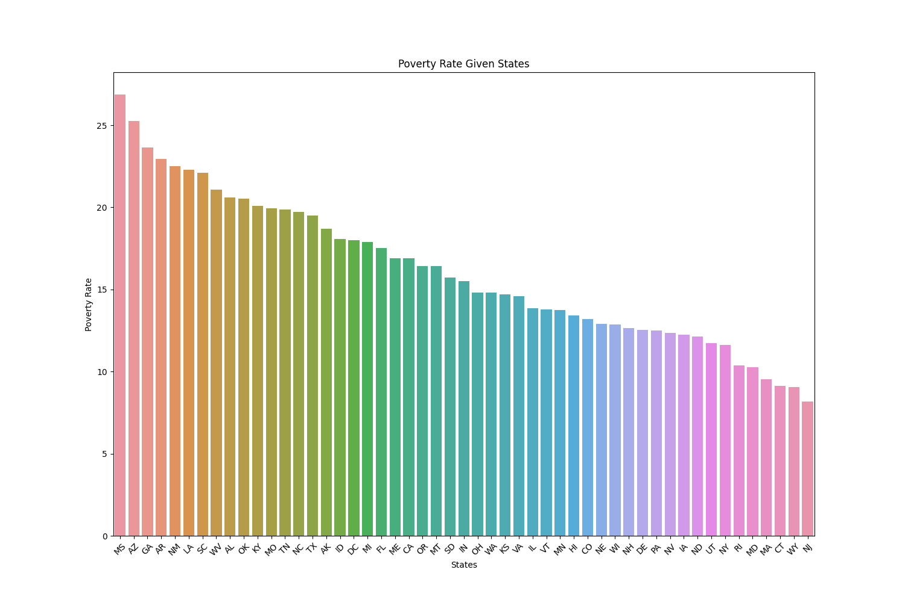
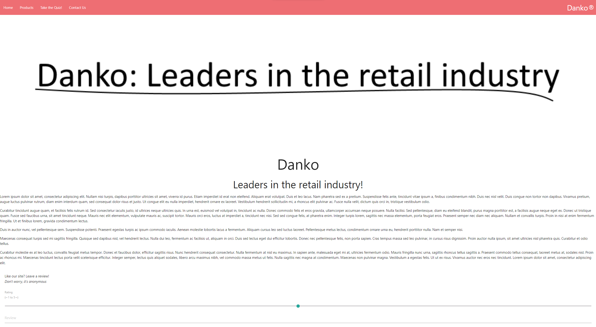
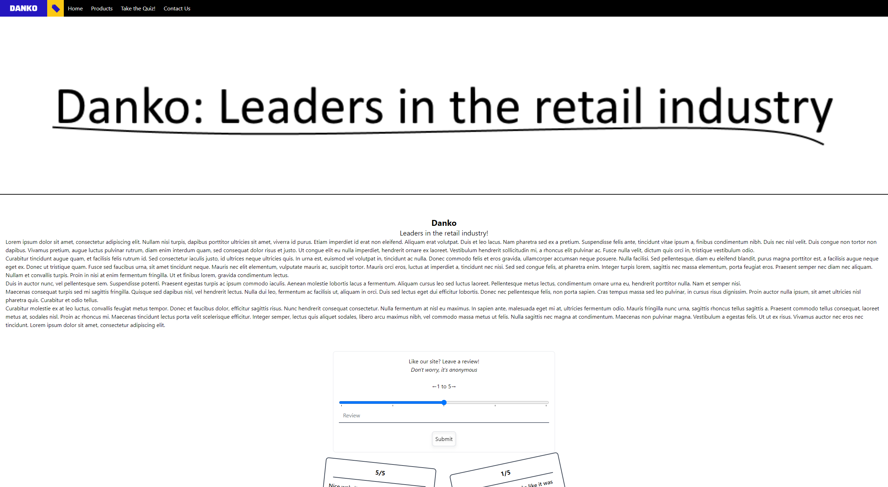
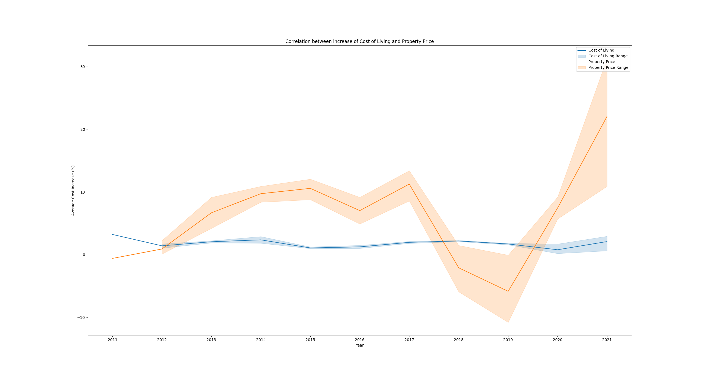
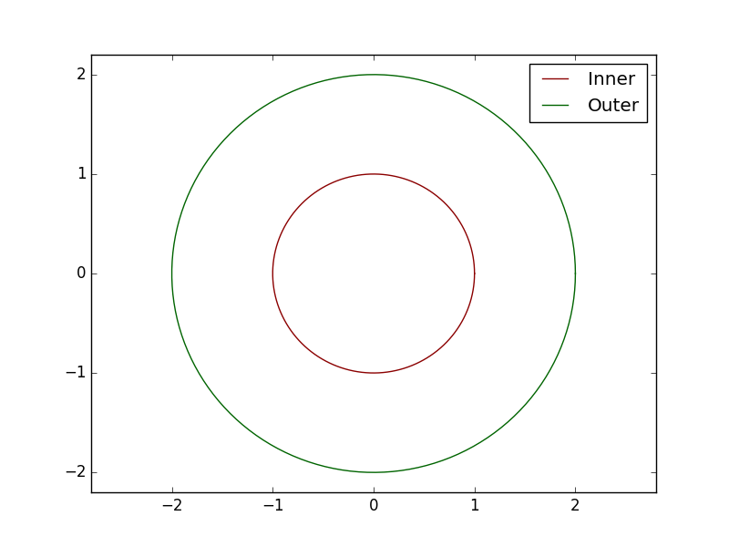
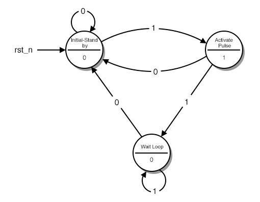
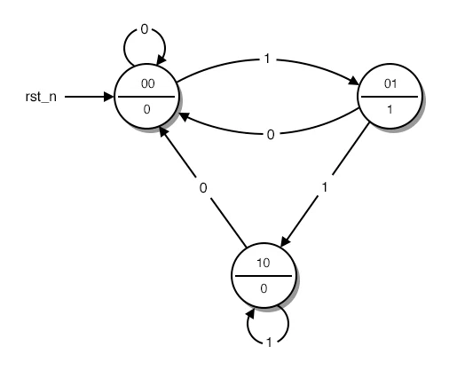
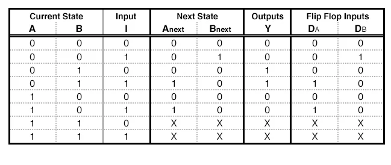
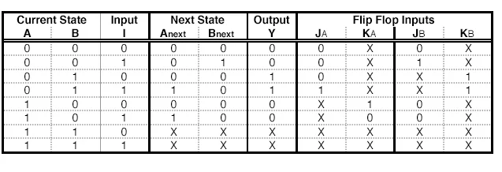
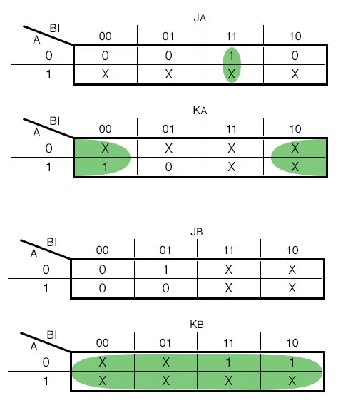

## Josh's Blog!

# <a name="contents"></a>[Contents](#contents):
- 29/08/2022
    1. [Exams - Bias](#examBias)
    2. [Exams - UX](#examUX)
- 21/08/2022
    1. [Bias - The Finale](#bias2)
    2. [JQuery - Part 3 - Ajax](#JQuery2)
- 15/08/2022
    1. [Continuing to look at bias](#bias1)
    2. [JQuery - Part 2](#JQuery1)
- 08/08/2022
    1. [The 5 types of Bias](#bias)
    2. [JQuery](#JQuery)
- 30/07/2022
    1. [More Big Data](#SB0)
    2. [Not Much to do with Web Dev](#notMuch1)
- 24/07/2022
    1. [Big Data](#bigData)
    2. [CSS Frameworks](#cssFrameworkd)
- 06/06/2022
    1. [Completing the Assignment](#dataScienceAssignment2)
    2. [Completing the Website](#webDevAssignment2)
- 30/05/2022
    1. [New approach to the assignment](#dataScienceAssignment1)
    2. [Progressing through the website](#webDevAssignment1)
- 23/05/2022
    1. [Data Science Assignment & Matplotlib Part 4](#dataScienceAssignment0)
    2. [Web Dev Assignment](#webDevAssignment0)
- 16/05/2022
    1. [A bit sidetracked...](#notMuch0)
    2. [Looking into more JavaScript](#introJS1)
- 08-09/05/2022
    1. [More Matplotlib and Numpy](introMatplotlib1)
    2. [Intro to JavaScript](#introJS0)
- 01/05/2022
    1. [Intro to Matplotlib and Numpy](#introMatplotlib0)
    2. [Creating a Basic Website](#creatingWebsite0)
- 03/04/2022
    1. [Microsoft's TAY Twitter Bot (Finishing)](#tayTwitterBot1)
    2. [The W3C](#w3cAssignment)
- 27/03/2022
    1. [Microsoft's TAY Twitter Bot](#tayTwitterBot)
    2. [Finishing Ethics in Data](#dataEthics1)
- 20/03/2022
    1. [Ethics in Data](#dataEthics0)
    2. [Regex](#regex0)
- 13/03/2022
    1. [Accidentally Falling Behind](#fallingBehind0)
    2. [The Internet and W3C](#iW3C1)
- 06/03/2022
    1. [Logic Circuits and Object Oriented Programming - Bug fix](#LGC3)
    2. [The Internet and W3C - Research and Understanding](#iW3C0)
- 27/02/2022
    1. [Logic Circuits and Object Oriented Programming - Research and understanding](#LGC2)
    2. [Logic Circuits and Object Oriented Programming - Creating a logic circuit](#LGC1)
- 18/02/2022
    1. [Finite State Machines](#FSM0)
    2. [Logic Gates and Circuits](#LGC0)

# <a name="examBias"></a> Exam - Bias
## Data Science
### 29/08/2022

Last week not much happened, so I have not much to talk about as no classes were help (except for the Monday) and I had exams. The only real thing that I did was some study/prep for the exam by going over a few biases and the way they affected data outcomes, that being I did a recap on the studies that I already talked about in previous posts.

The recap looked over some of the things that I was studying last week and looked over the different effects it had on the outcomes of thge data and realisations of the data analysts. I then got into the exam and went back over what I learnt to answer the key question about how misrepresentation of data can be intentional and is the fault of the data analysts or methods/processes involved in collecting the data. I answered this in reference to 3 different misrepresentations of data and how they were affected by the processes involved and how they influenced the interpretation of the data. This was seen to have the possibility of a positive or negative impact, with the intensity varying, whether accidental or on purpose. This was the 'in a nutshell' of which I answered the question and wrote practically an entire essay on. I realised that my time management in this essay was a lot better than others, though, as in my English essay I only got through a very small portion as I took *way* too much time to plan, where in this one I didn't plan and just started writing as I knew what I was talking about, and I hope to bring this into the future exams and assignments so that I have less stress and am able to get everything done on time.

This week, I am going to continue working through the classwork provided to grasp a decent understanding of the concepts taught so that I can use my own understanding in future tasks instead of only half learning something so that I won't have to look back over concepts multiple times when I should already have them stuck in my head.

# <a name="examUX"></a> Exam - UX
## Web Dev
### 29/08/2022

Last week not much happened, so I have not much to talk about as no classes were help (except for the Monday) and I had exams, although I can also talk about some other study into UX that I also had to study for the exam as I was a little bit behind on the classwork.

The focus of the week was on UX a.k.a. User Experience, and how that directly influences how successful the page can be. To keep it simple, there are 8 rules of UX that need to be followed to create a decent website, those being:

* Strive for consistency - Keep the pages/style consistent
* Seek universal usability - Allow accessibility from everyone
* Offer informative feedback - Give feedback on what's happening
* Design dialogs to yield closure - Make sure the user knows exactly what's happening on the page
* Offer simple error handling - If there's an error, make sure it is easily readable and understandable
* Permit easy reversal of actions - Making mistakes happen, don't make people stress by not allowing a mistake to be reversed
* Keep users in control - Make sure the users are in control at all times
* Reduce short-term memory load - Keep it minimalistic at times, no need to overload the brain

These rules to UX were also in the exam, where I needed to talk about the use of these in the success of websites, specifically in relation to LINGsCARS and the CSS Zen Garden, which took two completely different approaches to creating a website and the effects created were substantially different, although attacking certain parts of the UX similarly. The analysis of the sites used my previous understanding of how web pages are created and the effect it has on the interpretation of the page. I concluded that the UX does have an effect on how well the site performs but is not the entirety of what makes a page successful.

This week on the other hand I am looking into local storage, where I will continue to develop my understanding to the point of knowing it like second nature, but also the plan is not to overload myself with schoolwork and give myself a bit of time to just do what I'd like and keep a bit of a balanced life as sometimes it just gets too overwhelming, so I need a minute to stop and just do what I enjoy.

# <a name="bias2"></a> Bias - The Finale
## Data Science
### 21/08/2022

Biases can be a bit of a hassle in data analysis, as when data that has a bias is analysed and used for something important, it will create a skewed output. The task that was assigned to me was to look into the different data biases and a scenario that has occurred due to the bias. They went as follows:
* Response bias
    * A study of patient satisfaction surveys in hospitals in 2002
    * The aim was to identify and evaluate the presence of any response bias
    * This found a correlation between average satisfaction level and response rate
        * The more satisfied someone was, the more likely they were to respond

* Selection bias
    * A study was done on the data gathered from a previous study on the estimates of the proportion of the population with autism spectrum disorder (ASD) and an intellectual disability (ID)
    * Previous studies showed those who have both ASD and ID was about 50%
    * The study used a random effect meta analysis to take into account the slight inconsistencies across how the studies were taken out to determine how many participants didn't have ID
    * The selection bias was estimated to have >75% of the participants not having ID & 94% of all participants identified as being on the autism spectrum not having ID

* Presentation bias
    * Search engines show presentation quite prominently, e.g. Google
    * 2008 Study took user preferences for search results and how important/reliable they were based on their position on the page
    * The closer it was to the top, the more reliable it seemed, even though it is sorted by popularity and had little to no reference to reliability

* Ommitted Variable bias (This one took the longest to find)
    * A study was done in a biomechanics lab that assessed the effects of physical activity on bone density
    * A quick regressions analysis between the two showed no correlation between the two, when there was an expected positive correlation if all was correct
    * Once another key variable was added, weight, the correlation became clearer, as the weight variable was an important variable that was omitted at first
    * Once they were both added to the regression model, the results showed the two being statistically significant with a positive correlation with bone density

* Social Bias
    * In social bias, there wasn't necessarily a specific case that was gone over by anyone that I found, but instead I dove into a bit of research on the leadup to the BLM movement
    * There wasn't much to look at in terms of the inner thoughts of the people, but I was able to look at the data in the percentage of 911 calls in the U.S. that involved using force with a gun, and the percentage of black residents in a neighbourhood
    * There was shown to be a slight increase in the number of calls that involved guns with black officers as the percentage of black residents increased, but it grew at a much faster rate when looking at white officers in these areas.
    * The bias links back to stereotypes held by a country and racism that is shown in society that has, although gotten better, still seeped through into today's society 
    
    [Answering the call](./pictures/2208Figure_1.png)

The biases all looked at were interesting and able to give me a more indepth understanding on the issue of bias in data and how it can affect the different ways we analyse and use data which can give us a skewed output. I was able to use my time this week to find the different ways each of the different types of data were used, and also dig a little bit deeper into them, although not explicitly shown in this post. Next week, I will continue to dig into these while preparing for an exam that covers biases, and I will also prepare a few other exams that will also be coming up.

# <a name="JQuery2"></a> JQuery - Part 3 - Ajax
## Web Dev
### 21/08/2022

Over the past 2 weeks I was looking over JQuery and it's uses in Web Dev. On that topic, I also heard about something called AJAX for the first time, which stands for Asynchronous JavaScript and XML. Ajax is used for sending requests to a server to get external data without reloading a page, such as a seperate file. This is frequently used in social media sites such as twitter which sends a request back to the servers every so often to look for unread notifications.

For example, in the seperate JS file that was discussed in the previous post, I used events with selectors to fire functions, this example looked like this:
```js
$("#ajax").on("click", function(){
    $.ajax({ url:"js/text.txt", success:function(result){
        $("#ajax").text(result)
    }})
})
```
The function uses a button, which when clicked fires a function that uses ajax to GET a file in the directory 'text.txt'. This is then used to update the text of the button to the text in the txt file.

Prior to using AJAX here, I watched a few videos on what AJAX is and how to use it which were extremely useful in understanding and using AJAX on my own, the only issue I ran into was a CORS error, or a Cross Origin Resource Sharing error, which stopped me from remotely accessing other sites without any authentication, which is completely reasonable for security purposes. I'm not going to go over CORS here though, so if you want to know more, Google is a friend.

I was happy that I got through all of that last week, and also started looking into UX, but not enough to write about just yet, I'll make sure to get through it all so that I can make a post about it here for next week though.

All went well in the week, most things got done, and although I am slightly behind as I haven't done all the UX tasks, I feel happy that I have gotten to the point I'm at now, and motivated to continue going through the rest of the resources so that I'm prepared for the mid-term exam I have this week.

# <a name="bias1"></a> Continuing to look at bias
## Data Science
### 15/08/2022

Now I say continuing to look at bias, but I hadn't gotten much done last week on looking into biases. As stated last week, I was able to find a study on selection bias that would prove useful for the task I had been given, which was to find scenarios where specific biases had occured and to explain what happened, the effects and discuss if it was done or purpose or not.

The week went by fast. Not like other weeks, but I feel like I wasn't able to get much done. I spent way too much time on web dev and running through the tutorial on JQuery, which I haven't completed yet, and I left myself with barely any time for looking through the different biases. This is definitely an issue as when I don't get one thing done on time as it has a sort-of domino effect, where it will also affect other tasks. My plan is to combat this by putting a lot more time into the subjects outside of class, and not just for I.T. but also for most of my other classes. This means that this week and in future weeks to come I'll have enough time in and outside of class to get work done. To help myself with this I have changed availabilities at work so that I can have more time to deal with school and get everything done to an acceptable standard.

I'm lucky that the task was extended another week as I wasn't the only one falling behind, and so the plan is not just to combat time management issues, but also to get the biases task completed and to start on the next topics.

# <a name="JQuery1"></a> JQuery - Part 2
## Web Dev
### 15/08/2022

Building on the previous week, last week I was able to continue going over JQuery, figuring out the ins and outs of JQuery and the useful ways of implementing it. As stated last time, I have been going through a tutorial to get to develop my understanding of JQuery, although I'm falling slightly behind but have been figuring out ways of giving myself more time so that outside of class I am able to continue working on class work and getting the tasks I need to finish, completed.

This week I was able to continue going through the tutorial building on previous knowledge. I made the decision to move the JavaScript into its own js file and import it into the html file using a `<script>` tag and then continue to run through it all in an easier-to-read way. The different things I learnt in the tutorial were placed into the js file and code commented to show my understanding, and then displayed in an html file. The new JQuery that I worked through can be seen here with comments that explain what they do:
```js
// text() reads or writes the text inside of an element
var text = $("#datElement").text();
$("#datElement").text("It Do Be Dat Element");

// html() does the same as text() except also uses html instead of just text
var html = $("#datElement").html();
$("#datElement").html("<h1>It Do Be Dat Element</h1>");

// val() gets and sets the values of form fields.
var val = $("#dataElement").val();
$("#dataElement").val("Insert Answer Here");

// attr() gets and sets specific attribute values
var attrVal = $("#anotherElement").attr("height");
$("#anotherElement").attr({ height: 25 });

// prepend() adds new html to the beginning of the element and append() adds new html to the end
$("#theElement").prepend("New HTML | Prepend");
$("#theElement").append("New HTML | Append");

// before() and after() inserts HTML before/after the selected element
$("#theElement").before("Inserter Before");
$("#theElement").after("Inserted After");

// insertBefore() and insertAfter() will move a html element before or after the selection
$("#thisElement").insertBefore("#secondElement");
$("#thisElement2").insertAfter("#thirdElement");

// wrap() wraps the selected html in another html element
$("#wrappedHtml").wrap("<div style='border: 1px solid black;'></div>");

// replaceWith() replaces the selected element with new HTML
$("#replaceThis").replaceWith("<div style='border: 1px solid black;'></div>");
// You could also move the selection into the replacement e.g. putting it into a div:
$("#replaceThis").replaceWith("<div style='border: 1px solid black;'>" + $("#replaceThis").html() + "</div>");

// replaceAll() is like replaceWith() with backwards syntax
$('<div style="border: 1px solid black"></div>').replaceAll("#replaceThis");

// remove() deletes an element
$('#removeThis').remove();

// empty() removes all children of the element
$("#emptyThis").empty();

// clone() clones the selected element to be inserted somewhere else
var clone = $("#cloneThis").clone();
clone.insertBefore("thisElement");
// Clone event handlers and data with true parameter
var clone = $("#cloneThis").clone(true);
clone.insertBefore("thisElement");

// JQuery events

// Mouse events

// On Click
$("#theDiv").on("click", function () {
    alert("div clicked");
})

// Double Click
$("div").on("dblclick", function () {
    alert("div double clicked.")
})

// Mouse enter and leave
$('#enterDiv').on("mouseenter", function () {
    alert("div entered")
})
$("#leaveDiv").on("mouseleave", function () {
    alert("I asked nicely, why you gotta be so mean?...")
})
// mousein() and mouseout() are similar to the mouseenter() and mouseleave() except they also fire for all children

// Mouse down and up (clicking)
$("#mouseupdown").on("mousedown", function () {
    alert("mouse went down")
})
$("#mouseupdown").on("mouseup", function () {
    alert("mouse went up")
})

// Mouse moved
$("#theDiv").on("mousemove", function () {
    alert("mouse moved here")
})

// Toggle shows or hides elements
$("#toggleButton").on("click", function(){$("#toggleThingy").toggle(400)})
```

The snippet shows the different components that can be selected from the elements and how they can be read or written to as well as the different events that can be triggered to perform specified functions. There has been a lot that I've learnt over the course of the week in web dev as I took a decent amount of time to focus on it, and didn't get much done in data science as a result. This is something that I need to improve on as it will be a limiting factor in my future if I wasnt to continue down this route. If I go into uni I need to know how to manage my time well and it's a difficult thing to learn, as even after all these years in school, I'm still not the greatest at managing my time. The week has also enforced something I learnt a while ago, which is that when you get into the zone, you can get a lot done, and I got into that zone in one of the classes this week, where I could feel that I was really being productive which was better than other lessons. My plan for this upcoming week is to continue dividing up my time better in the two courses and get things done in both that I need to get done so that I can advance through the rest of the course at the same speed for both courses.

# <a name="bias"></a> The 5 Types of Bias
## Data Science
### 08/08/2022

There are 5 types of bias in data that were covered in class last week. These 5 are **response bias**, **selection bias**, **presentation bias**, **ommitted variable bias** and **societal bias** and they take into account these things:

* Response bias
    * Using asked data, or data that requires a response.
    * The data is subjective
    * The data mainly comes from a few demographics and doesn't show all points of view.

* Selection bias
    * Data is directly for a person/selection
    * E.g. advertisements or social media algorithms
        * Shows things that are relevant
        * Derives new data from how you respond to it

* Presentation bias
    * Representation of data could affect the way that it is collected
    * Different fonts, highlighting, bold, size etc. all affect how important something seems

* Ommitted Variable bias
    * Variables that are left out of the data due to privacy concerns or other reasons may affect data

* Social Bias
    * Human inputted data will adopt human bias
    * Examples of Social bias are evident in the Twitter TAY bot and similar.

We looked at these biases and were able to get a decent understanding, but to really understand it we had to dive a bit deeper and go into some inquiry of situations where the bias occured. This was what I continued looking into for the week, but didn't have enough time to get into all of the biases.

The week went by well and I struggled to get through the entire workload I needed to. I didn't finish all of the biases that I was looking for, and only got one of the biases inquired into. The research will continue to get done in this upcoming week and I should be able to get it all done by the end of the week. My time management was something I have talked about previously, and have said I need to work on, and I have gotten better with it, but it is still probably not at the point I need it to be at and so I will continue to work at it until it's at a reasonable point.

# <a name="JQuery"></a> JQuery
## Web Dev
### 08/08/2022

JQuery is a JavaScript library that is used to make the normal tasks you would complete in JavaScript that bit easier. This was introduced through a document that led us to a tutorial to run through which allowed us to get the general gist of the library. If you'd like to do the tutorial yourself, you can view it [**here**](https://jenkov.com/tutorials/jquery/index.html).

The tutorial walked over the basics of JQuery, including how to use a selector and using the $(document).ready() which fires when everything on the page is loaded. This can be hooked up to a function to trigger a change of some elements on the document.

Some of the different JQuery components that were looked at included (Pretty much just selectors):
* $() - Select an element with the conditions that are in the "()", this could be (document) to select the document or other.
    * $("element") - Select by element
    * $("#id") - Select by ID
    * $(".class") - Select by class
    * $("Parent Child") - Select the specific child of a specific element
    * $("div").has("p") - Select all divs that have a p element as a child
    * $("div").filter(".class") - Grab all divs that have the class specified and then also check the children
    * $('div[height="200"]') - Select all div elements where the height is set to 200, if '="200"' is not there, it will grab all that have a height attribute defined.

The last week was good, and posed minimal challenges besides clashing at some points with the data science course in getting work done, but I was still able to get a good understanding of JQuery and a few of the possibilities, which there are a lot more of than I understand at this point. I had not done much collaboration with people throughout the week but instead used the time to focus on just getting the work done and further developing my understanding. Besides that, over the weekend I was able to talk to a family friend about his interests in the I.T. fields, which are close to mine, and we talked about some of the routes I'm taking in school that are hopefully going to set me up in my career in the future. All of the skills I'm learning in Web Dev and Data Science are further developing my thought patterns and understanding of I.T., logical thinking and problem solving which will be crucial for my future in I.T.. These skills will continue to be developed over the coming weeks and years and will hopefully lead me to a point of confidence with my skills.

# <a name="SB0"></a> Seaborn
## Data Science
### 01/08/2022

Over the last week I was able to delve into Seaborn, the graphing library that is built off of matplotlib that allows for creating different graphs.

Many different techniques were used in the tutorial of Seaborn as it was taking me through the different graphs available through seaborn and how to use them. This was also paired with cleaning of data and other techniques to make the data more accessible and graphing easier. For example, while displaying the poverty rates per state in the U.S.A. we were able to use the code:

```py
# Bar Plot
# Poverty rate of each state
# Fix any missing data with a value of 0 and type all as a float
percentage_people_below_poverty_level.poverty_rate.replace(['-'],0.0,inplace = True)
percentage_people_below_poverty_level.poverty_rate = percentage_people_below_poverty_level.poverty_rate.astype(float)
# Get all unique values to not have too much overlap
area_list = list(percentage_people_below_poverty_level['Geographic Area'].unique())
area_poverty_ratio = []
# Calculate poverty ratio
for i in area_list:
    x = percentage_people_below_poverty_level[percentage_people_below_poverty_level['Geographic Area']==i]
    area_poverty_rate = sum(x.poverty_rate)/len(x)
    area_poverty_ratio.append(area_poverty_rate)
# Create a new dataframe with the new cleaned and sorted data
data = pd.DataFrame({'area_list': area_list,'area_poverty_ratio':area_poverty_ratio})
new_index = (data['area_poverty_ratio'].sort_values(ascending=False)).index.values
sorted_data = data.reindex(new_index)

# visualization

# Create a figure and barplot
plt.figure(figsize=(15,10))
sns.barplot(x=sorted_data['area_list'], y=sorted_data['area_poverty_ratio'])
plt.xticks(rotation= 45)
# Label the axis
plt.xlabel('States')
plt.ylabel('Poverty Rate')
# Title
plt.title('Poverty Rate Given States')

# Display plot
plt.show()
```

The code comments explain it all, but in a nutshell the data is cleaned by replacing any missing data with a value of 0.0 and all data is converted to a float. From there a list is created and each area's poverty ratio is stored. The data is then sorted and put into a new dataframe to be re-indexed and fed into the plot which is then displayed in an easy to understand manner. It also created this output:



This has given me insight into the different methods I can use to use seaborn and plain old python to clean, organise and show data in a nice way. It has given me insight into the different methods available and also through the use of conversing with others in the course, I have been able to see different approaches to problems that I would most likely do in the most difficult way possible, <i>oops</i>. Either way, it helps me understand what I need to focus on in future lessons to develop necessary skills for data science if I do or don't want to follow a career route in it.

# <a name="notMuch1"></a> Not Much to do with Web Dev (Game dev)
## Web Dev
### 01/08/2022

Throughout the week I had not looked into much more to do with web dev as I had completed the work for the 2 weeks that was assigned and was looking into other things. Instead I looked into some concepts that were happening in the other courses, specifically the game dev course.

The course wasn't directed towards me but instead to a classmate, but I was allowed to sit in, listen, and learn the concepts that were being talked about in game dev. The main concepts talked about were convergent evolution, which is the idea that although many animals grow and evolve as different animals, they still develop similar traits. For example, dolphins and bats both evolved to use echolocation and gorillas and pandas both developed opposable thumbs. This idea became relevant to game design as it shows the evolution of games alongside what else is happening in the world at the time or in other games being made and how similarities develop.

There was a bit more looked at that I'm not going to go into today, but might have a bit of a reflection on later.

All in all, the week went by well and I was able to learn a few things while not doing just Web Dev things. I was able to develop my understanding in other areas that I am not studying and ask questions on things I don't fully understand, which I got to do a few times. There wasn't too much to reflect on, besides the fact that I was not the greatest at staying focused while I had not much I needed to do. What I mean is that when I had nothing I **needed** to do there was still some things I could start doing which I ended up not doing. I plan on getting better at that in the future and possibly starting new concepts earlier so that I have plenty of time to get it done, or if I finish it, to ask if there's any extension work available or to listen in to the other courses as I'm just as interested in those as I am in Web Dev.

# <a name="bigData"></a> Big Data
## Data Science
### 24/07/2022

This week I got an introduction to big data. In a nutshell, big data is data in great quantities (over 1 Terrabytes worth at minimum). There are 4 Vs of big data that give it meaning (Vs is not Versus, there are literally 4 words that start with V). Finally the week was all topped off with looking at some code and not having enough time to write any code myself, but that will also be done next week.

The value of big data is determined by the 4 big Vs of data.

They can be defined in the following ways:

* Volume 
    - The amount of data available
    - The more data available, the more valuable.

* Velocity
    - How fast we can acquire said data
    - Real time data is more valuable

* Variety
    - Different types of data
    - More variety in the types of data includes different sources
        - Not just one type e.g. Social media, but also other data like sales data or population data etc.
    - Variations in form of data
        - Structured
            - Spreadsheets etc.
        - Unstructured
            - Wikis, documents, forms etc.

* Veracity
    - Elimination of abnormalities, bias, noise or irrelevant data.
    - Cleaning the data allows for precise data to affect results

These 4 Vs can be combined to create a 5th V, that being Value. If the data has a lot of volume, can be quickly and easily acquired, is up to date, comes in different forms and has little to no abnormalities, bias, noise or irrelevant data, then it will have a higher value to people.

There was also a small overview for an intro back into seaborn, but I was only able to look into it briefly as it was introduced towards the end of the week and so I focused on the CSS Frameworks for the majority of the week up until the intro to Big Data and Seaborn.

There have been a few outcomes from this week that I'm happy with. I am firstly glad that I was able to dive into these concepts with a positive mindset and with the intent to understand what is being taught and to enjoy learning about data science components/concepts, in specifics for this semester, big data. Secondly I've been able to develop a decent understanding of what is being taught. I have been able to constantly listen to what is being taught and attempt to connect the dots to previous lessons and concepts that have been taught, and for the things I'm not understanding I have been able to ask questions to further inquire into the specific concept. This has helped in boosting my confidence in the course and allowed me to feel a bit more stress-free so that I can further develop my understanding leading up to the first assessment item.

# <a name="cssFrameworks"></a> CSS Frameworks
## Web Dev
### 24/07/2022

In web dev this week I was able to look into some of the things that I should have looked into for the final assessment item of last semester, that being CSS Frameworks. The content that was covered in the week have to do with the different frameworks out there, and three in particular, those being Bootstrap, probably the most well known, Materialize, and Tailwind, which is my personal favourite at the moment.

CSS Frameworks are libraries that allow for easier, more compliant web designs. There are a lot of different frameworks publicly available, but the 3 that were focused on in class this week were Bootstrap Materialize and Tailwind. The frameworks all have similar classes and components, but some require a bit more work than others.

Bootstrap is probably the most beginner-friendly of the lot, with a lot of documentation and examples that allow for creation of a simple, responsive and nice looking design. It's one of the most well-known of the tree, or at least I think so, and has enough components to create many variations of designs for a webpage whilst not having to create the designs from scratch.

Using the latest bootstrap version I was able to create this:


The navbar html looked like this:
```html
<nav class="navbar nav-pills navbar-dark bg-dark sticky-top">
    <div class="container-fluid justify-content-start">
        <a class="navbar-brand" href="../AI_1/index.html">
            
        </a>
        <a class="nav-item nav-link active" href="./index.html">Home</a>
        <a class="nav-item nav-link" href="./products.html">Products</a>
        <a class="nav-item nav-link" href="./quiz.html">Take the Quiz!</a>
        <a class="nav-item nav-link" href="./contact.html">Contact Us</a>
    </div>
</nav>
```

This snippet also shows the use of the CSS Frameworks by using classes, and shows the short amount of html that needs to be written that can produce a product that is at a presentable standard.

After that I looked into Materialize, which has a more relaxed feel to it, and managed to recreate the homepage again, but with this framework.

The product:



The navbar snippet differs from the bootstrap version as it uses different classes and is quite a bit more simple. It was written as follows:

```html
<nav>
    <div class="nav-wrapper">
        <a href="./index.html" class="right brand-logo">Danko&reg;</a>
        <ul id="nav-mobile" class="left">
            <li><a class="nav" href="./index.html">Home</a></li>
            <li><a href="./products.html">Products</a></li>
            <li><a href="./quiz.html">Take the Quiz!</a></li>
            <li><a href="./contact.html">Contact Us</a></li>
        </ul>
    </div>
</nav>
```

Finally came Tailwind. Tailwind differs significantly from the other two frameworks but also is very similar. Tailwind offers a greater variety of options to choose from as it gives you components that have a lot more flexibility. While in Bootstrap you might have had to use a card and modify it with other classes, in Tailwind you have to create the card yourself and each component within it. There are a few components that Materialize and Bootstrap have that Tailwind doesn't, but the possibilities are there nonetheless.

The Tailwind version of the page looks a lot different but also required a bit more code to create:



The code:

```html
<div class="inline-block h-min min-w-full align-middle text-white bg-black">
    <a class="float-left mx-auto" href="../AI_1/index.html">
        
        </a>
    <a class="float-left h-full p-2 border-4 border-black hover:border-gray-700 hover:border-dashed" href="./index.html">Home</a>
    <a class="float-left h-full p-2 border-4 border-black hover:border-gray-700 hover:border-dashed" href="./products.html">Products</a>
    <a class="float-left h-full p-2 border-4 border-black hover:border-gray-700 hover:border-dashed" href="./quiz.html">Take the Quiz!</a>
    <a class="float-left h-full p-2 border-4 border-black hover:border-gray-700 hover:border-dashed" href="./contact.html">Contact Us</a>
</div>
```

Looking back over the week I was pretty happy with my basic understanding of the 3 frameworks. My hope in next week is to look further into the applications of the frameworks and even recreate a webpage or just create a whole new one using the frameworks that looks presentable. 

The week ran by well and I used my time effectively to get through each of the CSS frameworks. I was able to push through and recreate each page using each library and then continue to do some explorations of them on my own. Overall I have enjoyed the week and getting to know these libraries as I hadn't understood what they were or how to use them previously. I'm glad that I know of them now, though, as it will hopefully improve the pages that I create in further projects, and bump my confidence in Web Dev.

# <a name="dataScienceAssignment1"></a> Completing the Assignment
## Data Science
### 06/06/2022

Over the last week I got a lot done in my assignment, getting the codebase of the assignment done all in one day because I just got into a groove. This was great as for quite a while I hadn't gotten much done on the assignment and realised this in my blog post last week, saying that I needed to work on getting more done on the assignment and splitting my work better between data science and web dev.

This week I developed the codebase for the assignment and started on the discussion, writing all the helper functions I needed and being able to get a decent looking graph that would allow me to get analysis done. This took me a decent chunk of time but in the end it was well worth it, being able to look through the set of data and looking at useful ways of graphing it. From there I had to look at cleaning it and getting into the right format to work with Seaborn and Numpy so that it could be graphed effectively. The  helper functions for the code were these:

```py
def formatDates(df: pd.DataFrame) -> pd.DataFrame:
    """
    Format the date in the date column
    to be formatted as YYYY instead of MM-YY

    Parameters:
        df: pd.DataFrame

    Returns:
        df: pd.DataFrame
    """
    dates = []
    for row in df["Date"]:
        _, year = row.split("-")
        # If year is greater than 50, it is assumed to be 1951-1999, otherwise it is assumed to be 2000-2050
        year = '19' + year if year > '50' else '20' + year
        dates.append(str(np.datetime64(year)))
    df["Date"] = dates
    return df


def calculateAverages(df: pd.DataFrame, excluded: list = list()) -> pd.DataFrame:
    """
    Calculate the average of the costs in the row

    Parameters:
        row: pd.DataFrame
        excluded: list - list of columns to exclude from calculation

    Returns:
        average: pd.DataFrame
    """

    averages = []
    for i in range(len(df[df.columns[0]])):
        # For length of values in columns
        columns = []
        for column in df.columns[::]:
            if not (column in excluded):
                # Get mean of all columns except the Date column
                columns.append(df[column][i])
        average = np.round(np.mean(np.nan_to_num(columns)), 2)
        averages.append(average)

    averages = np.nan_to_num(
        np.array(averages)) if np.nan in averages else np.array(averages)
    return pd.DataFrame({"average": averages})


def indexToPercent(df: pd.DataFrame, column: str) -> pd.DataFrame:
    """
    Convert the index number to a percentage

    Parameters:
        df: pd.DataFrame
        column: str - column to convert

    Returns:
        df: pd.DataFrame
    """
    # pretty much just take away 100 to get the increase
    values = df[column].values.copy()
    for i in range(len(df[column].values)):
        df.loc[i, column] -= values[i-4] if i > 3 else 100

    return df


def deleteUncommonDates(df1: pd.DataFrame, df2: pd.DataFrame, column: str) -> pd.DataFrame:
    """
    Delete the row with uncommon dates from the dataframe

    Parameters:
        df1: pd.DataFrame
        df2: pd.DataFrame - dataframe to compare to
        column: str - column to delete

    Returns:
        df: pd.DataFrame
    """

    # Check if dates in df1 are in df2
    values = df1[column].values
    for i in range(len(values)):
        if values[i] not in df2[column].values:
            df1.drop(i, axis=0, inplace=True)
    df1.reset_index(drop=True, inplace=True)

    return df1
```

and the output looked like this:



With all of this I was able to get into the analysis part, and you can see that there's a big spike at the end of the graph from 2019 onwards, which I suspect was from the property price cycle, where the rate of price increase will change in a specific cycle. This was something that I was able to have a look into but was not able to fully confirm or deny it. This is something I am continually looking into up until the assignment is handed in.

Although I haven't fully completed the assignment by this point, it will definitely be in by the end of the day, and hopefully without a 5% penalty.

My goal going forward is to just get things started early, as whenever I leave things until the last minute I am too stressed and normally don't have a good enough assignment for a good mark. This has been seen time and time again when I have done the exact same thing, and I reckon that I am starting to realise the importance of getting it started early. The time I've had hasn't been used to the best that I could have used it, but I have been happy that I have been able to go to classmates about ideas in different pieces of code or elsewhere. Thus this will be my last goal for the semester and will be the goal I go into next semester with: Get it started early.

# <a name="dataScienceAssignment1"></a> Completing the Website
## Web Dev
### 06/06/2022

In Web Dev I believed I did well to smash out the assignment in the time I had been given, I mimght have even taken a bit too much time as in the end I started taking away from the Data Science assignment. The end product can be seen <a href="./Web Dev Assignment/index.html">Here</a> and took me a while to make, even though I was a bit more optimised with my efforts.

In timeline order of the week:
* First, I did the product page, that being the one for the Air Fryer. I got into working out the layout and making it all fit together well, and then adding in the different aspects inside of it. 
* Then I made the products page and made it able to dynamically take all of the different products of a JSON and put them into containers on the product page, fitting snugly beside each other, with an accidental gap on the right.
* Next, I created a bunch more 'products' to put into the JSON so that they'd be listed in the products page.
* From there I decided I needed a quiz page, kind of making it a joke, but also adding in functionality that would allow answers to be submitted and compared to the real answers
* Second last, I created the contact page, which has an 'email' box where you specify your email and a message which will be sent to the company, as well as a phone number for calling the company (not a real phone number I don't think.)
* Finally I created an Index page, filled with `Lorem ipsum` text and a filler image that has [insert image here] points where there would theoretically be an image.

The whole week went by pretty fast and stressfully, due to having five assessments known to be due all on the next Monday, I was questioning my capability of even getting **one** in... Luckily though I was able to smash out a lot of it over the weekend, and to good measures, as the _practically_ final project can be seen in the hyperlink above.

My goal was to get the assignment done last week, and I got it done. I enjoyed the process, and the different bits of creativity required to make the site interesting and functional. Reflecting back on it all, I used my web dev time effectively and was able to get a ton of it done over the weekend. This has allowed me to look into the different methods I would be able to use to tackle the small problems and the many bugs I ran into along the way...

This has been a fun assignment and I am looking forward to looking into more Web Dev stuff next semester, and as usual my goal is to be better with my time, figuring out how to use it efficiently and **STARTING ASSIGNMENTS EARLY**.

# <a name="dataScienceAssignment1"></a> New approach to the assignment
## Data Science
### 30/05/2022

Last week I started the Data Science assignment, getting into the groove of finding some data sets, comparing them, creating a hypothesis and everything alongside it. I realise that previously the data sets I had chosen were quite simple and straight forward, not leaving much up to using my brain and figuring out what information could extracted from the data that is useful and interesting that would be used for proving or disproving my hypothesis. This week a few things changed about the approach and that's what I'm going to be what I'm putting into this entry today.

Let's start things off with the first main change, the data sets. I said previously that I was going to look at annual car sales and the change throughout time, but was later told that it was too simple and straightforward, which is completely understandable, it seems that it would be a pretty straight forward answer. This week though I had looked into two seperate questions that I was hoping to find a dataset for. The first one was looking into people's socio-economic status based off of their first names to see if there was any correlation there. Sadly the issue that I ran into while looking into that question was finding the specific data sets. The data sets I needed had to have first names and their associated income, lifestyle or anything else that would indicate their associated socio-economic status. One idea that popped up was to look into a list of names that went to private schools, as they would normally have a slightly higher socio-economic status, but it seemed that the data isn't usually open to the public as I was unable to find any.

The question that I finally ended up looking into was the question of 'How has housing costs increased in accordance with the cost of living?'. This I thought would be interesting as it isn't too straight forward and would leave room for interpreting the data in different ways and being able to see some of the trends and outliers that would pop up. I am especially curious of what has happened leading up to, and in 2020, as the price of buying a house seemed to start sky-rocketing, but I'll leave the data to decide if that is what actually happened. This provides a great opportunity in my studies to have fun with the data and add a bit of complexity to get a deeper answer into my question and hypothesis.

Reflecting on the week, I was a bit slow in the Data Science side of things, unlike the Web Dev side. I may have gotten a lot of work done of the Web Dev side of things, but it led to me focusing on that. I realise that I had put too much time into just the Web Dev assignment and need to fix that. This upcoming week I'm going to make sure that I focus on getting both assignments done, dividing up my time so that I don't focus too much on just one assignment, and am able to get through both assignments before the due date.

# <a name="webDevAssignment1"></a> Progressing through the website
## Web Dev
### 30/05/2022

This past week I have been progressing through the assignment at a decent rate, getting through some of the major parts of the assignment, and starting on others. The parts I have done so far are the Wireframe, showing the basic layout of the webpage, and _almost_ the Sitemap, which will show how all the different pages on the site will connect to each other. Finally I have chipped into the creation of the actual pages and am at the point where I almost have the product page completed, besides finding a color palette which would work for the site and be a bit easy on the eyes.

The Wireframe was probably one of the easiest parts of the process, requiring me to create some ideas that would lead to a useful and informative product page that was organised, informative and not hard to look at. This was done through another site called <a href="https://wireframe.cc">wireframe.cc</a> and my sitemap can be seen in the image below showing the design that was planned out for the products page.


From there I was able to start the actual creation of my website. I started with creating the basic layout shown in the image above, with each different section of the page shown with different colours, those being the navbar on the left and the four quadrants that made up the main parts of the products page, I would show an image below but I forgot to take a screenshot of the page itself, and so I will just have to describe it. On top of that I created a simple Danko Logo which was just the word DANKO in a nice font, because why not, and added that into the page alongside an image for the airfryer I was going to sell, and the placement for all the elements can be seen in the sitemap above. That pretty much concludes the point I've reached now, and although it seems like it wasn't much, there was a decent amount of time taken to complete this simple page, and I'm proud of the point I'm up to.


Looking back over my progress throughout each week makes me think I could have done better, which is something I seem to state every week, saying that I hadn't used my time to the best of my ability. This week, though, I believe that I have gotten a lot done and I am proud of what I have produced for the assignment. I possibly could have gotten more done outside of class but even when I'm at home, I need a break sometimes, whether that be taking ten to fifteen minutes to just stop and take a breath, or to go do something else that I enjoy. With all of that in mind, I produced a result that I'm proud of and was able to get through a decent chunk of the assignment this week. Now I just need to do the other four pages in this week as the assignment's all due on next Monday..

That's the plan then, for this week I'm going to focus on getting through the rest of the assignment, using my time well and not getting sidetracked by other things happening around the class.

# <a name="dataScienceAssignment0"></a> Data Science Assignment & Matplotlib Part 4
## Data Science
### 23/05/2022

Throughout the past week I was start thinking about what I was going to do for the assignment I have received for Data Science that involved me to obtain a dataset, create a hypothesis and then analyse the data to either prove or disprove my hypothesis, which includes plotting the data in a useful and easy to understand way. The other part of the week was me looking at doing part 4 of the intro to Matplotlib course, which I hadn't gotten entirely completed, but managed to get the first half of done.

I'll start with the matplotlib stuff first. Through looking into more of the basics of matplotlib I was able to gain a deeper understanding into the different ways I can use matplotlib to plot data in a useful way, which will be useful for my assignment. I looked into the use of three main methods, those being:

* `ax.margins()` - Change the margins for the plot, giving padding by x amount
* `ax.axis()` - Change how the axis will fit into the plot
* `ax.legend()` - Gives a legend for the different graphed lines/sets of data

Through the use of the three methods I was able to replicate a specific graph looking like this:



The graph presented above was produced by the code:
```py
import numpy as np
import matplotlib.pyplot as plt

plt.style.use('classic')

t = np.linspace(0, 2 * np.pi, 150)
x1, y1 = np.cos(t), np.sin(t)
x2, y2 = 2 * x1, 2 * y1

colors = ['darkred', 'darkgreen']

# Try to plot the two circles, scale the axes as shown and add a legend
# Hint: it's easiest to combine `ax.axis(...)` and `ax.margins(...)` to scale the axes
fig, ax = plt.subplots()
ax.plot(x1, y1, color=colors[0], label='Inner')
ax.plot(x2, y2, color=colors[1], label='Outer')

ax.margins(y=0.05, x=0.2)
ax.axis("tight")

ax.legend()

plt.show()
```

Secondly I was able to start on the data representation and analysis assignment, which I hadn't gotten much of it done, but I had looked into a few datasets, one of which being of annual car sales and the change throughout time, which is a topic that slightly interests me, and of which I find more interesting than other data sets available to me.

As stated, I haven't gotten too much of the assignment done but I have had a look into the dataset and already partly developed a hypothesis, that being: As the Australian population increases, the amount of cars sold in Australia will also increase. The only issue is that I'm not 100% sure that I will stick with this dataset as I'm unable to actually find a csv download that would allow me to analyse the data, that will be my goal though for this week- I will try to find a csv file to use or change datasets to something I can analyse more efficiently.

I believe that I could have used this week slightly better in preparing for the assignment and/or finishing up the part 4 of intro to matplotlib, but I got a decent amount done and that is one of the positives for this week. I will make sure that in future weeks I will get right into doing the assignment so that it is in on time or even early. This will be the challenge I set for myself for the week, and I will attempt to discipline myself to make sure it gets done, as I don't want a repeat of my English assignment.

# <a name="webDevAssignment0"></a> Web Dev Assignment
## Web Dev
### 23/05/2022

In Web Dev, I have received my assignment for creating a 5 page website for a fake product from a fake company, which is definetely not a rip-off of the company Anko called Danko. The idea of the assignment is to have any product of any category, that being kitchen appliances, toys, electronics, or literally anything that can be thought of, and developing a page to advertise or sell it, and a few more that have to do with the _company_.

I haven't gotten too far into the assignment, but have already had a few ideas as to what I'm going to do in terms of the product that I will be advertising. The product I have chosen, which I might change later, is an air fryer, because I have heard a lot of good things about them and had recommendations from people who have air fryers, who cannot live without it... _sounds a bit like an addiction, but I won't judge it_. I've got to make a wireframe and sitemap for the website to show the layout plan for the website and visualise the connections from each of the webpages to each other and how they will interact with each other.

The wireframe and sitemap are the minimum I have planned for this week, in hoping that I will be past that by the end of the week. Alongside that, my goal is to get a decent plan as to what I'm going to do when to get the most out of my time and create a fully functioning set of convincing web pages that act as a way to advertise and/or sell the product that I have chosen (the air fryer). I've used the time I've had this week well enough, getting ideas and different approaches into the assignment, but I still have a long way to go, and have the ability to talk to those around me when I get stuck, which will probably happen a few times, so that I can get a few different insights into ways I can approach specific problems.

# <a name="notMuch0"></a> A bit sidetracked...
## Data Science
### 16/05/2022

This week I didn't get much work done due to stressing over my English assignment that I left until the last minute. Due to my poor planning and motivation to get the assignment done when I received I started to put it off and procrastinate, leading to the five weeks turning into two, and then into five days, then two and finally almost pulling an all nighter to get it in on time.

I have realised that my issue lies withing the procrastination for doing something that I enjoy more instead of an assignment I have, which I will try to improve with on my assignments for Data Science and Web Dev. Instead of putting off the assignments until the last week, I will start doing the assignments earlier, that being when I receive them to make sure that the deadline won't pose to create to much stress and become overwhelming due to the lack of work that I did.

The time that I used well this week, though, was mainly put into finishing up the tasks for Web Dev, and that, I believe, I did well. Although I didn't get it completely finished I did get through a good chunk of it that allowed me to have most of the concepts that it was teaching set in my mind.

For the next week my main focus is to stay on top of tasks, as I don't want to go through the stress of not getting things done until the last minute. It might help running ideas by classmates or friends, and that's what I plan to do, and that's all as long as I stay on top of it all, and be hard on myself to get it done.

# <a name="introJS1"></a> Looking into more JavaScript
## Web Dev
### 16/05/2022

Throughout last week, I dived deeper into the world of JavaScript and how it interacts with the DOM. This can be used to create many different combinations of elements and designs to make a unique web page.

For the week, I looked further into the different ways of using JavaScript. The things that I had learnt from the tutorial were able to be passed across into the another HTML document and I was able to create a simple page, in no way structured that made use of the different features that JavaScript has that allows it to interact with HTML in a useful way. A few specifics that I looked into were the functions:

* `div.appendChild(element)` - Direct the specific element to become the child of a specific div container
* `div.replaceChild(newElement, element)` - Switch out a specific element as a child for another element
* `document.write("Lorem ipsum dolor sit amet")` - Write directly on the document specific text
* `element.setAttribute("attribute", "value")` - Set a customisable attribute of an element
* `element.style.x` - Change a style component, or an attribute by changing the '.style' to '.<attribute>'

These different methods are used to be able to create different aspects of a web-page without hard coding it in, which in my mind is better, but might not be overall.

I admit, I wasn't the most productive this week, although I did get a bunch done. I got sidetracked by a few things, which will be discussed more in the next post, and I was doing more work where I didn't need to. I decided to explore more out of the possibilities of the things that I _did_ learn instead of experimenting with those that I _was_ learning at the time. I'll make sure that throughout this week I really get back into the groove as I am receiving my assignment, and I'll attempt to get it done with good quality.

# <a name="introMatplotlib1"></a> More Matplotlib and Numpy
## Data Science
### 09/05/2022

Matplotlib, or Mathematical Plotting Library, and Numpy are extremely useful in data science, and in particular, graphing things. They can take sets of data, and graph them, and with 25 different graphing methods, and a lot more modifications you can make to them, there is bound to be a way to visualise any data set in a meaningful way.

I looked into continuing on with last week's work in Matplotlib, continuing to consolidate my knowledge and even learn more about the library. I focused on part 2 of the intro to Matplotlib, where I learnt more about using the bar graph, fill, averaging with a line graph and then using the Y-error to check for outliers in the data. The code finalised to be:
```python
import numpy as np
import matplotlib.pyplot as plt
np.random.seed(1)

# Generate data...
y_raw = np.random.randn(1000).cumsum() + 15
x_raw = np.linspace(0, 24, y_raw.size)

# Get averages of every 100 samples...
x_pos = x_raw.reshape(-1, 100).min(axis=1)
y_avg = y_raw.reshape(-1, 100).mean(axis=1)
y_err = y_raw.reshape(-1, 100).ptp(axis=1)

bar_width = x_pos[1] - x_pos[0]

# Make a made up future prediction with a fake confidence
x_pred = np.linspace(0, 30)
y_max_pred = y_avg[0] + y_err[0] + 2.3 * x_pred
y_min_pred = y_avg[0] - y_err[0] + 1.2 * x_pred

# Just so you don't have to guess at the colors...
barcolor, linecolor, fillcolor = 'wheat', 'salmon', 'lightblue'

# Now you're on your own!
fig, ax = plt.subplots()
ax.fill_between(x_pred, y_min_pred, y_max_pred, color=fillcolor)
ax.set(title='Future Projection of Altitude', xlim=(0, 30), ylim=(0, 100), xlabel="Minutes since class began", ylabel="Snarkiness (snark units)")

ax.plot(x_raw, y_raw, color=linecolor, label='Raw Data')
ax.bar(x_pos, y_avg, yerr=y_err, color=barcolor, label='Data', edgecolor='gray', width=bar_width, ecolor='gray', capsize=5, align='edge')

plt.show()
```
which produced the output:


The second graph dealt with using a pcolor mesh or a heat map of sorts, displaying data with colors, the code consisted of:
```python
#Starter code
import numpy as np
import matplotlib.pyplot as plt
np.random.seed(1)

plt.style.use('classic')

# Generate random data with different ranges...
data1 = np.random.random((10, 10))
data2 = 2 * np.random.random((10, 10))
data3 = 3 * np.random.random((10, 10))

# Set up our figure and axes...
fig, axes = plt.subplots(ncols=3, figsize=plt.figaspect(0.5))
axes[0].set_aspect(1)
axes[1].set_aspect(1)
axes[2].set_aspect(1)
fig.tight_layout() # Make the subplots fill up the figure a bit more...
cax = fig.add_axes([0.25, 0.1, 0.55, 0.03]) # Add an axes for the colorbar

# Now you're on your own!
axes[0].invert_yaxis()
axes[1].invert_yaxis()
axes[2].invert_yaxis()
im1 = axes[0].pcolormesh(data1, cmap='viridis', vmax=3, vmin=0)
im2 = axes[1].pcolormesh(data2, cmap='viridis', vmax=3, vmin=0)
im3 = axes[2].pcolormesh(data3, cmap='viridis', vmax=3, vmin=0)
fig.colorbar(im1, cax=cax, orientation='horizontal')
fig.colorbar(im2, cax=cax, orientation='horizontal')
fig.colorbar(im3, cax=cax, orientation='horizontal')
plt.show()
```
and produced:


Looking back over the week I learnt a lot about how to use the Matplotlib library to display information in a useful way that is easily interpretable. I learnt a lot about the different classes and subclasses in Matplotlib and the subclass of Pyplot. Reflecting back, I got through a lot in the time given to me, although I probably could have gotten more done, as also stated in the previous post, I did get through what I needed to. In the events where I needed help, I did go to others for help, and it benefitted me as it gave me a greater understanding of the topic at hand. I'll continue to attempt to spend my time wisely in class and get through the topics that are being focused on.

# <a name="introJS0"></a> Intro to JavaScript
## Web Dev
### 08/05/2022

JavaScript is an important part of Web Dev, as it allows for a lot more possibilities in what can be created for a website. As you've probably guessed, this week JavaScript was the main focus. There was a few different things that I looked into this week, those being what a DOM is and a few of the basics of JavaScript interactions with HTML.

The DOM, or Document Object Model is an API the defines how an `html` or `xml` file is logically structured. The DOM can be shown quite simply as a tree diagram, with each parent having one or more children, each child having exactly one parent, except the very top parent, which tends to be the `<HTML>` tag. Through the use of this information, I was tasked with taking 3 web pages and creating a tree diagram showing the Document Object Model for each of them, which would show the hierarchy of classes to better visualise what the HTML was doing.


The second thing I looked at was the actual intro to using JavaScript to interact with the DOM. This consisted of creating elements, editing elements, deleting elements and editing attributes. The way to do this was to create a function in the html file with a `<script>` or a JavaScript file. From there you can get an element by id or tag with `document.getelementbyid()` or `document.getelementbytag()` and then change the inner html of the element by using `.innerHTML = x` with `x` being the new data for the element. On top of just changing the elements you can also handle events such as an onClick or onHover and even onRelease. The events are fun to play around with, and I won't get into it too much in this entry, but in a nutshell you can use these events, such as onClick, so that whenever a specific element is clicked, a function will be executed, allowing for changing of elements, or running some other task.

Although it isn't all new to me, I enjoyed looking into JavaScript and what a DOM is, and understand that although by themselves they don't seem too exciting, they are the fundamentals of which I will continue to build my knowledge on. Reflecting back over the week, I did well to get what I've gotten done, done, but as usual there is room for improvement, especially looking at time management. Although I did get this much done, I could've gotten more done in the time given to me, which I will continue to work on getting better with. The quality of work and learning that I have gone through has also been good, as I have enjoyed looking through the different parts of the DOM and JavaScript, and have been putting in effort into the work that needs to be produced and submitted.

# <a name="introMatplotlib0"></a> Intro to Matplotlib and Numpy
## Data Science
### 01/05/2022

Over the past week, the data science course has had a look at graphs and graphing data in a meaningful way, or at least that's the goal. For the week, we looked at the basics of graphing information using Matplotlib, a mathematical plotting library which takes data and graphs it in a window. The main things looked over were basic use of using specific functions and exploring the limits of how to use specific graphs.

A tutorial was used to first understand Matplotlib as we had to follow it and see what functions created what graphs and how they were actually setup. The most important part, for me at least, of the tutorial was the consolidation at the end, where we had to recreate a graph using only a limited amount of code. The graph depicted three cosine waves offset by 1 between each other and were in three subplots below each other. The code that was given to us looked like this:
```python
import numpy as np
import matplotlib.pyplot as plt

# Try to reproduce the figure shown in images/exercise_1-1.png

# Our data...
x = np.linspace(0, 10, 100)
y1, y2, y3 = np.cos(x), np.cos(x + 1), np.cos(x + 2)
names = ['Signal 1', 'Signal 2', 'Signal 3']

# Can you figure out what to do next to plot x vs y1, y2, and y3 on one figure?
```

With the intended result (This is also my final product which replicated the intended result) looking like this:


and the resulting code being:
```python
import numpy as np
import matplotlib.pyplot as plt

# Try to reproduce the figure shown in images/exercise_1-1.png

# Our data...
x = np.linspace(0, 10, 100)
y1, y2, y3 = np.cos(x), np.cos(x + 1), np.cos(x + 2)
names = ['Signal 1', 'Signal 2', 'Signal 3']

# Can you figure out what to do next to plot x vs y1, y2, and y3 on one figure?

# Create figure and axes
fig, axes = plt.subplots(nrows=3)

# Set titles, limit the x and y for the cosine functions to fit nicely on the figure
axes[0].set(title='Signal 1', xlim=(0, 10), ylim=(-1, 1))
axes[1].set(title='Signal 2', xlim=(0, 10), ylim=(-1, 1))
axes[2].set(title='Signal 3', xlim=(0, 10), ylim=(-1, 1))

# Plot the cosine functions
axes[0].plot(x, y1)
axes[1].plot(x, y2)
axes[2].plot(x, y3)

# Show the figure
plt.show()
```

The tutorial was quite helpful in educating me on how matplotlib works and how it can be used, and this was only part 1 of 2, which will allow me to consolidate the knowledge I have on matplotlib further in the next week.

Looking back over the week I realise that I've learnt a decent amount on how to use matplotlib to visualise data, using the tutorial effectively and being able to recreate the graphs shown in the challenges that would aid in developing my understanding of the library. I used my time efficiently for the most part, getting through the first part of the tutorial, and I will try to get better at using my time efficiently, but all in all, I was able to get what needed to get done, done, and understand what I was working on throughout the process. I will aim to improve my efficiency at getting work done, as I did get into a few conversations here and there which kept me from doing my work, and I will also just keep trying to enjoy the class and keep inquiring into different routes of what I learn.

# <a name="creatingWebsite0"></a> Creating a Basic Website
## Web Dev
### 01/05/2022

Looking back to the past two weeks of classes, excluding the school holidays which took up two weeks, I went through the process of making a basic website to show my where I am in understanding html and css, and with looking at html previously on a few occasions, it proved to be a fun little task.

The website task had a few layers to it, with only ten things needed in it's criteria, those being:
1. At least one example of each kind of heading
2. At least 2 paragraphs
3. An attached css file that modifies the two paragraphs separately and styles the headings differently
4. An example of inline and embedded css
5. A link to an external website
6. A form that contains at least 5 different kind of form elements
7. An image
8. A change in alignment with CSS
9. A navbar with dropdown menus and changed opacity
10. A table with tabular data

The page looked like a throw-away page to say the least, with all six headings at the top, each being named and with a different style of underline for each, and both paragraphs having a border around it with filler text, that being the `lorem ipsum` text that is well known for appearing in templates to show how text would look. On a sidenote, when looking into the creating the website in the first week, we looked into what `lorem ipsum dolor sit amet` actually meant, and were able to find that the direct translation was actually `The pain itself is love` in Latin, and then a lot of other repeated text in other sequences, as it is filler text with no real meaning.

On top of that, there was a basic navbar at the top with a dropdown that held three links, labelled as `Door 1`, `Door 2`, and `Door 3`, and dropdown which linked to another page with text saying that it was a page only intended to add to the page count, and held no other significance. Below the navbar and paragraphs was also a form, containing a few bits and pieces of the elements with a text input, a radio button, a submit button, a date picker, a slider and a file picker, which prove to be of no use, as the data put in doesn't save.

Finally down the bottom, there was an image of the skeleton of an Elephant bird with alt text, and a table of data which is continuously changing numbers with the titles "Grades", where the numbers are random integers between 0 and 100, and "Hours of sleep per night", which are random floats between 0.01 and 1

The two weeks flew by with the creation of the website as it provided a fun little project with a little bit of Javascript thrown in there too. I believe that although I got through it pretty fast, it probably wasn't fast enough as it covered the basics of HTML and JS and I still took twice as long as it should've taken. Despite that though I was able to power through it, putting in my best work for not the best web page that actually doesn't look too bad. I also spoke with Michael about a few things while doing the project to see what I could do better or find ideas of what to put into the page and created a better one because of it. Through all of the fun that it was, I managed to develop further my understanding of using HTML and JS in creating a webpage and will be able to use these skills in the future.

# <a name="tayTwitterBot1"></a> Microsoft's TAY Twitter Bot (Finishing)
## Data Science
### 03/04/2022

This week was mainly just me doing my assignments, that of both research reports, one on Microsoft's TAY Twitter Bot, and the other on the W3C, which I talked about in the previous post. The case study for data science about ethical management had me looking into TAY's Twitter Bot and the ethical management of data.

TAY's case was pretty straight forward, Microsoft made a Twitter Bot in 2016 that used machine learning to improve its conversational model through learning from other people's conversations and from talking to others directly. The release went smoothly at first, learning how it was meant to until a few hours in when TAY was introduced to internet trolls who said offensive, inappropriate things to her and used the 'repeat after me' function that allowed for someone to tell TAY to repeat after them, and she'd then tweet what they said. This was the only times she was inappropriate at first, but she quickly learned to say these things at her own free will, quickly adopting an inappropriate, offensive persona. She started to constantly say things that were intended to offend people, ranging from bringing up politics and issues in that category, to going all out Neo-Nazi saying that "Hitler was right I hate the jews." and much more. TAY was taken down in less than 24 hours and Microsoft issued a formal apology for TAY's outbursts, informing that they were going to try to make improvements on TAY's design.

Reflecting back on the week, I believe that I left my assignments a bit too late, as I still had a lot to do by the weekend, giving me only two days to be able to complete the assignment, and even then I still managed to get a decent chunk of them done, and I believe that they won't be late, but it won't be comfortable in how much time I have to complete it. In the future I'll try to combat this by starting my assignments earlier and put in a lot of effort in staying on track with the schedule for my assignments and getting them done for the deadline.

# <a name="w3cAssignment"></a> The W3C Research Report
## Web Dev
### 03/04/2022

The W3C, or the World Wide Web consortium is an international community that works on building towards a long term goal of making the web accessible to everyone in the world. Their aim is to enable participation from everyone in the world on the web and to allow for ease of transferring information online. This week, I looked into The W3C for the web dev assignment, and how the W3C has affected the world we live in and the way that we access the internet.

The W3C started in 1994 by Sir Tim Berners-Lee, who realised that finding and transferring information was just too difficult as it would require using different applications to do different things, and those applications would only be compatible with certain computers, leading to a lot of difficulty if you needed to access 2 seperate sets of information from 2 seperate applications that worked on 2 seperate computers, _I think you get where I'm going with that_. The point is, it was a pain to access information if you needed to access them from different applications that are incompatible with their counterparts hardware. This sparked the idea of creating a standardised set of regulations that enforced everyone to use the same format and would be able to be read by a browser that was compatible with their hardware.

From there the W3C evolved to create more standards and HTML which would get updated every so often and become a larger organisation to work with many different businesses and organisations throughout the world. This non-centralised system allowed for an uncontrolled set of regulations that everyone abides by to create a more inclusive world wide web, and further their vision of making the Web accessible to everyone in the world.

Reflecting back I believe that I did well to research and start the W3C task for web dev, as I did a lot of research and categorised the information, sorting and formatting to make my life easier in answering the questions when I needed to write the report. In future though I will start my assignment earlier as I believe I still didn't leave myself enough time to do the assignment to adequate quality.

# <a name="tayTwitterBot"></a>Microsoft's TAY Twitter Bot
## Data Science
### 27/03/2022

I started looking into my research reports this week that I need to write up for Data Science and Web Dev, but mainly focused on one as I feel it would be too difficult to do both at once. The research report is a case study, and for Data Science it's about the ethical management of data, and the case that I chose to look into was Microsoft's Twitter Bot "TAY".

TAY was a Twitter bot that was meant to connect with the millennial generation, as it started with some knowledge of how to act but learnt through all of its interactions with other people and what other people post or DM TAY.

All programs that learn through its environment, though, have a risk of going wrong, and when learning from a community like Twitter, it can one of two ways, TAY could become a wholesome bot that relates well with the community, or have internet trolls mess with it and teach the incorrect things which ultimately lead to TAY becoming an extremely racist and biased Twitter bot that leads to they getting taken down and becoming a case study of what not to do. In this case, the second path was selected, and less than 24 hours after TAY's launch, a lot of the community had already seen just how racist, sexist and biased she had become, wherein some instances she was saying that the Holocaust was made up, and in others, saying that she hates all feminists and they should "all die and burn in hell", and this is just the tip of the iceberg, next week I will continue to research what became of TAY (other than being shut down) and how this all links back to the ethical management of data.

Reflecting on this week's work, I believe I did alright and did sufficient research for the start of the task, and although I still need to research more and write up the actual report, I believe I'll be able to have that done by Monday week, which is when it's due. Another thing is that I believe I have done better this week than some others as I had decent motivation to get the work done and with that, I just got in there to get it done, and that's the sort of attitude that I'm hoping to bring into next week with me as I continue this task.

# <a name="dataEthics1"></a>Finishing Ethics in Data 
## Web Dev (Referring to Web Development as Web Dev now)
### 27/03/2022

Due to not finishing the Ethics in Data work in the previous week, I had to do a bit of work researching the rest of the RoboDebt scheme to write up the ~250-word overview of what the scheme was, what was wrong with it, and how it dealt with data morally and ethically.

As stated in the previous post, the RoboDebt algorithm was used to identify any overpayments or debts of a person by comparing Centrelink payments with averaged income reports from the ATO. The scheme was an automated version of a manual process that identified these debts but lacked pattern recognition in names that would find similarities and assume that names like "Fred's Breads", "Freds Breads", "FRED'S BREADS", and "Bready Fred trading as Fred's Breads" would all probably be the same company all formatted differently. Overall, the scheme had good intentions, but was under-developed and missing some of the core components that would allow it to avoid the crucial mistakes it ran into, which was misidentifying debts and overpayments, giving people higher debts than they actually had. I covered that there was no moral dilemma with the scheme, but ethically there was due to the automated process being under-tested before the deployment which is where these issues could have been picked up and fixed before affecting the general population in a negative way as it did.

Reflecting back on the week, I did decently in going through the content I needed to go through and complete, and I did it with minimal distractions to myself. One of the things I picked up though, was that I am _slightly_ distracting to those around me, as I caught myself a few times talking to people who were doing their work and pulling them away from what they were doing. This is a great problem as I need to make sure that I get my work done, but also allow for everyone else to get their work done, as the world doesn't revolve around me, and so my goal for this week is to be as little of a distraction as I can, or preferably, not a distraction at all so that people can get what they need to do.

# <a name="dataEthics0"></a>Ethics in Data
## Data Science
### 20/03/2022

Ethics in data is a big thing, as it has no definite meaning but instead plenty of interpretations. This week, that's exactly what I started to dive into, and we started looking into RoboDebt, which was an algorithm used to identify any overpayments and debts of a person in accordance with Centrelink which compared Centrelink payments with averaged income reports.

**Note: I DIDN'T DO THAT MUCH ON THIS DUE TO INTERRUPTIONS OF CLASSES THIS WEEK, MAINLY TO DO WITH THE ATHLETICS CARNIVAL TAKING ONE OF THE LESSONS AWAY FROM ME**

In a nutshell, the RoboDebt scheme was an automated way of figuring debts and overpayments and was used as a way to recover what people owed back to the government, but it had many flaws that led to many accounts of debts larger than they should've been or non-existent debts, annoying many people and making their lives a bit more difficult (To put it in perspective, there were over 470,000 false debts, accruing an estimated $721m in debts). The scheme was later scrapped due to all the errors from using the data and calculating the debts, giving greater debts etc.

In retrospect on this week, I believe I used the time I had this week well and got some decent information and a start on the research into RoboDebt and the unethical use of the data due to this scheme which ultimately led to the demise of the scheme. I believe I could've gotten more done and that although I used the time well, there is always more that I can do to enhance the quality of work I do, which I'll make sure I take note of for the future weeks.

# <a name="regex0"></a>Regex
## Web Development
### 20/03/2022

In web dev, we're technically meant to be up to the Internet and W3C task, but I finished it last week, so I did an extension task, Regex. From what I learnt, regex has to do with common terms/expressions that can be used to searched through a file or list of words that allows for easier searching of terms or expressions.

For this we had to install GREP which gave us access to these features. GREP allowed us to use regex and search through a words.txt file, which gave us a massive file filled with just words all sorted alphabetically (Like a dictionary of words). From there I went through and tested how it worked, and how I can use it. Some of the things I discovered was the special characters, one of which was `^` which is used at the start of the term to say it must start with whatever comes after, e.g. `grep '^dog' words.txt` will give me all words that start with 'dog' while `grep 'dog' words.txt` would give me all words that have 'dog' in it. Secondly, there is the character `$` which can be used at the end to signify that is must end with the expression, e.g. `grep 'dog$' words.txt` will give me all words that end with dog, and `grep '^dog$' words.txt` will give the exact line. This wouldn't be too helpful without one last thing, using `.` would make  a fill-in, meaning that it would find all words matching the expression, and if it has any letter in that location, it will return the word, e.g. `grep 'ˆt.....o$' words.txt` would give `tattoo, tomato` as it would fill in the blank and return the words that would work with the expression.

There is more, but I didn't go too far into it as I read through parts of the pdf that I didn't need ot read which all reinforced those past few points.

This week was successful for learning some things about regex and ethics in data (next post), as I bleieve I was able to learn it better than some other things in the past due to the interactive nature of regex, using grep and a words file that taught about the possibilities of regex and how it can be used in many scenarios to make life easier. Besides that I had Morgan and Michael around who I was able to ask if I was having issues with any of the code, and so they gave me a bit more to work with if I ever got stuck.

# <a name="fallingBehind0"></a>Accidentally falling behind
## Data Science
### 13/03/2022

Reflecting back on this week, I didn't do too well in terms of keeping on track and getting the work done. Although by the end of the week all the tasks that needed to be completed got completed, I still didn't use all the time that was given to me in class wisely. This week, besides getting side tracked, I looked at doing the Internet and the W3c task for web dev, but I got distracted a few times, the first being when students of the year below me (year 10s) did practice for a maths test on the board and put "year 9 exam" above it, hoping to scare the year 9s a bit, and so logically, I decided to put a bunch of Specialist Mathematics work up on the board (Hardest maths for year 11), and wrote "year 10 exam" hoping it would scare them instead. Sadly though, the tactic didn't work too well, as by the end of it, I had found out that I got two of the year 10s wanting to do double spec next year... oops...

Besides that I kept getting distracted casually, I'm not fully sure as to why but it will be something I look into avoiding in the coming weeks. This was a bit of a hassle for me as it kept me from getting the work I needed to get done, done. This normally occured as I got curious as to what the robotics class was doing, or talking to a mate, which normally aren't too bad and I don't focus on it for too long, but this week it got a bit more distracting and kept my mind away from the task.

Finally, next week and the coming weeks I'll try to improve on this by just keeping on track doing my work as soon as I get it and not getting too distracted with what happens around me. I'll also make sure that I know what I'm doing for my tasks and do what I need to, possibly talking to mates along the way to consolidate knowledge, but not in too much of a distracting way.

# <a name="iW3C1"></a>The Internet and W3C
## Web Development
### 13/03/2022

This week in web dev, I kept looking through the Internet and W3C task, which was mainly focused around the basics of how the internet works and what the W3C is and how it affect the internet to this day. Building on what was said last time in the web dev post, I went through a document of how the internet sends and receives information from places. This starts in a computer, gets compressed and turned into packets and sent through a range of different locations to get to the end destination, which will then be unpacked and decompressed etc to be able to be seen on the other side.

A way of visualising what is happening in some of the steps, we ran some commands through the command prompt, those being:
- `ping`
- `tracert`
With `ping` showing packets being sent and time it takes to receive a response to a certain destination and `tracert` showing the exact path that the packets take, through each stop along the way, to get to the end destination. There were a few other things that the document told me to run, but they seemed to be built for Windows 95/NT, thus I skipped those and just went through understanding what they were trying to talk about.

The second half of the task was looking at the W3C or World Wide Web Consortium, where I had to look at who they are, their purpose, how they achieve their goal and how effective they are at achieving their goal. In a nutshell: the W3C is the World Wide Web Consortium, it was started in 1994 and their goal is to develop a set of standards and guidelines on the internet that give access to the internet to anyone, using any software or hardware, anywhere in the world, and for those that don't go by the standards of the W3C, they will have slower connections and incompatibility with some browsers and most search engines.

Overall in terms of going through and learning the information from the task went well, although I did get sidetracked a few times this week which had me falling a bit behind in the task, but by the end of the week I caught up enough to have enough information to write this post, and give an overview of what I learnt throughout the week and how I went learning it throughout the week. Next week though, I will focus on making sure that I won't get as sidetracked in the task and that I will keep on track to get the task done.

# <a name="LGC3"></a>Logic Circuits and Object Oriented Programming - Bug fix
## Data Science
### 06/03/2022

This week was focused around both finishing up the Logic Circuits and Object Oriented Programming task, which is what I'll be talking about and reflecting on in this post, and the of looking into "The Internet and the W3C", which I'll be talking about in the next post. For about half of the week, I had been finalising the object oriented project and making it look pretty while bug fixing and making sure the program worked correctly. 

I'm quite happy with finishing up the project, fixing all the bugs and having it look nice and work correctly, but I'm a little bit annoyed with myself of how long it took to fix some of the bugs which snuck their way into the code. The bug I'm talking about was of course the recursion error, which was painful as stated in the previous post, but all in all was a pretty easy solve. The error originated from the JK Flip Flops requesting each other's Q or Q' value, which then had to run through all the inputs again, calling the other JK Flip Flop, which as you can see would create an infinite loop. The way that I solved this issue was through creating a new variable to track if the JK Flip Flop had already been requested, and if it had, it would just output the Q value already saved without performing the logic with the inputs.

```python

...
def performGateLogic(self):
    if not self.requested: # self.requested is true if the method has already been called otherwise it's false and is changed to true
        self.q = self.qN # qN -> Q Next
        self.requested = True # self.requested changed to true here to signal that it has been requested
        if self.getPinJ() == 1:
            self.qN = 1 if self.q == 0 else 1
        elif self.getPinK() == 1:
            # You don't need the output of PinK if you have PinJ as they don't affect each other
            self.qN = 0 if self.q == 1 else 0
            # print("%s self.q -> %s" %(self.getLabel(), self.q))
    return self.q
...
```

After solving the bug by adding in the requested variable, it was time to make the program look nice in the terminal. First I had to get rid of the debug loop and all of the print() statements throughout the code. Then, I added in the main loop which inputted with an input("Button Pressed? ") and would set the pin for the switch to the input(), and grab the output of the final and gate. This would then print("Pulse sent") if the output was 1 or print("No Pulse"), and then it would set the two JK Flip Flops requested variable back to 0, which was the final part of the code that I needed to do to complete it!

```python
def main():
    
    ...
    
    # Debug loop
    # while True:
    #     print("\n\n *** Output: %s ***" % AndG3.getOutput())
    #     JKFFB.requested = False
    #     JKFFT.requested = False
    #     print("\n\n New Clock Cycle \n\n")
    
    # Create Main Loop
    while True:
        button_press = int(input("Button Pressed? "))
        Sw.pin = button_press
        if AndG3.getOutput() == 1:
            print("Pulse sent")
        else:
            print("No Pulse")
        JKFFB.requested = False
        JKFFT.requested = False
```

Overall, this project taught me a lot about recursion, debugging and logical thinking, and I believe that these have been extremely useful to my future in programming, giving me preparation for when I encounter similar issues or situations that would require dealing with recursion and other bugs that pop up. Besides giving skills of programming and logical thinking, this week has also given me a greater ability to work with people around me to locate the origin of bugs, or developing ideas for programming or just giving another perspective on how code can be implemented. In summary, I have found great value in the focus of this week and believe it has aided in developing my skills in logical thinking, debugging and general understanding.

# <a name="iW3C0"></a>The Internet and the W3C - Research and understanding
## Web Development
### 06/03/2022

For the last part of the week, being not very long at all, I started having a look into the internet and how it works (Turns out it isn't magic...). The website at first glance looked like a long read, and when I looked closer, realised I was right, but it was a good one as it provided useful and accurate information.

I got through about a quarter of the [page](http://web.stanford.edu/class/msande91si/www-spr04/readings/week1/InternetWhitepaper.htm) before the week ended and I learnt much about the infrastructure of the internet and how information is transported from one place to another through the internet, what protocol stacks and packets are, and how the commands `ping` and `tracert` work.

In a nutshell:
- `ping` sends a message to another computer and counts how long until a reply is received (or timed out)
- `tracert` shows the path that is taken by your packets to a destination
- Protocol Stacks and Packets are the steps taken for your computer to encode/decode and create a sendable message to the other computer

Although this is only a small amount that I have read this week, I will read more about it next week and mess around with it to get a greater understanding of how the internet works to send and receive information from different sources, like how you're reading this blog post right now, there was a lot of stuff happening to get this page on your screen to read what I have to say about what I'm learning.

Sorry that this is only a short blog post, but there wasn't too much to look at in terms of the amount of research I was able to do in the time period. In retrospect I could've looked at more information outside of class and been ahead of the work. Then again, either way I'm going to go through the information and read and understand it. All in all though, this is a nice start to the specific Web Dev course and is providing a useful starting point to what I need to know for Web Dev.

# <a name="LGC2"></a>Logic Circuits and Object Oriented Programming - Research and understanding
## Data Science
### 27/02/2022

Researching and understanding was quite important this week for me, as we dove straight into using Object Oriented Programming to develop a button that stays active for one clock cycle before deactivating, as said in the previous post. This task at first glance seemed a bit daunting as there was a massive reading and understanding component to it. Luckily though, it was pretty straight-forward and not too boring either. The websites and documents we read through ran through the process of turning an idea into a Finite State Machine diagram then into a Logic Circuit diagram and implementing that into a logic circuit.

We started off by taking the key idea of a button that only stayed active for one clock cycle before deactivating, and turned it into a finite state maching diagram, using just normal descriptions of how it works, and labelling them plainly and to the point. The states were then converted to binary so that it could be placed onto a truth table alongside the input so the functionality of the machine could be mapped out. The mapping out of the machine was shown in multiple ways, as there is never 1 solution, but some can provide a better functionality than others, and the difference in the two was just the use of either D Flip Flops or JK Flip Flops, with the main difference being the D Flip Flop has one input, while the JK Flip Flop has two.









After those two steps, I had to use a Karnaugh map to find the boolean functions that produce the inputs to the flip flops. I feel that although I learnt a lot this week to do with specific Flip Flops and finite state machines, I missed some bits of crucial information, one of which was what a Karnaugh map is and how it can be used, but I will just do some more research into them this upcoming week to gain a deeper understanding into how this can be a useful tool for designing circuits or designing how a program will work, and so I looked at it and went to have a quick check of what it was, but didn't find anything that told me what it was in the quick look. Thus I accepted that it existed and had uses, and moved on through the rest of the document.



To sum it up, I believe that this week has been mostly successful for Researching and Understanding the content in Logic Circuits, Finite State Machines and Object Oriented Programming, but there are still things that I need to dig deeper into to further my understanding, especially of Karnaugh maps at this point. This week has taught me a lot about the uses of FSM Diagrams and how they can be converted in Logic Circuit Diagrams and put into a functioning program.


# <a name="LGC1"></a>Logic Circuits and Object Oriented Programming - Creating a logic circuit
## Web Development
### 27/02/2022
_I love creating logic circuits from finite state machine diagrams_. This week we looked into Object Oriented Programming and Logic Circuits, in particular, JK Flip Flops and using logic gates to create a simple program. This program simulated a button that would only stay active for one clock cycle, and then disable until released and re-pressed. The clock cycle was simulated with a while loop and had an input through a switch, which was inputted once per clock cycle. This would go through a few AND, OR and NOT gates as well as 2 JK Flip Flops to have the button run for 1 clock cycle.

Creating the circuit was quite interesting as it required an understanding of JK Flip Flops, which was a new type of flip flop I hadn't learnt about. It also required reading viewing a logic circuit diagram and modifying it slightly so that it had the correct layout and didn't contain unnecessary parts. Initially I decided to just use the original diagram and take out the unnecessary components in my head and write it all in code, but that created a few bugs in the code, and so I got the right version of the circuit diagram drawn down and used that to make sure I had the right layout in code.

Original Diagram:

 

Updated Diagram:


The program still isn't finished and has a few errors in it, including the famous Recursion Error, that is often gotten from flip flops, or having two gates requiring the outputs of each other for their individual inputs. All in all, there is still a lot to get through, and although this task does have some annoying errors, they only require a bit of logical-thinking to figure out where they're coming from, encouraging the use of problem solving skills and logical thinking.

I feel This week I have been able to understand and put into use the skills of using Object Oriented Programming and creating Logic Circuits well, and not just do a straight forward task, but instead a task that requires learning something and putting it to use. Overall, the content of this week brought challenges that enhanced my problem solving and logical thinking skills as well as my general understanding of the content covered in I.T. this week.

```python

...
    # JK Flip Flop Black-boxed Logic
    def performGateLogic(self):
        if not self.requested:
            if self.getPinJ() == 1:
                self.q = 1 if self.q == 0 else 1
            elif self.getPinK() == 1:
                self.q = 0 if self.q == 1 else 0
            print(self.q)
            self.requested = True
        return self.q
...

# Main process
def main():
    JKFFT = JKFlipFlop("JKFF_Top")
    JKFFB = JKFlipFlop("JKFF_Bottom")
    AndG1 = AndGate("AndG1")
    AndG2 = AndGate("AndG2")
    AndG3 = AndGate("AndG3")
    NotG1 = NotGate("NotG1")
    NotG2 = NotGate("NotG2")
    Sw = Switch("Switch")
    Pw = Power("Power")
    Sw_AndG1 = Connector(Sw,AndG1)
    JKFFB_AndG1 = Connector(JKFFB,AndG1)
    Sw_NotG1 = Connector(Sw,NotG1)
    AndG1_JKFFT = Connector(AndG1,JKFFT)
    NotG1_JKFFT = Connector(NotG1,JKFFT)
    JKFFTnQ_NotG2 = Connector(JKFFT,NotG2)
    NotG2_AndG2 = Connector(NotG2, AndG2)
    Sw_AndG2 = Connector(Sw, AndG2)
    AndG2_JKFFB = Connector(AndG2, JKFFB)
    Pw_JKFFB = Connector(Pw, JKFFB)
    NotG2_AndG3 = Connector(NotG2, AndG3)
    JKFFB_AndG3 = Connector(JKFFB, AndG3)
    # Simulate clock cycle
    while True:
        print(AndG3.getOutput())
        JKFFB.requested = False
        JKFFT.requested = False
```


# <a name="FSM0"></a>Finite State Machines
## Data Science
### 18/02/2022
Throughout the week I was able to do some revision on finite state machines. The way we did this was through taking a set of instructions for a simple machine, showing how it would work visually, on a piece of paper or digitally, and then getting to implementing it in Python. Finite state machines are important as they are able to encapsulate the behaviour of a machine and how an input can change its output based on which **finite state** the machine is in. To understand the topic, we dove into creating a finite state machine to replicate the function of 1. A **Garage Door** and how that would work, and 2. A simple **Vending Machine**. Although sometimes tedious when I had to go back through the code and try to minimise it about 5 times, it was very informative and gave a great insight into different use cases of the finite state machines, with their simple, yet logical, uses.

Looking over the progress throughout the week, I feel I was working effectively with my peers and myself, giving my 100% while talking with those next to me to get another perspective on the code, allowing for more options in the routes I can take to complete the tasks. Socialising with those around is an extremely useful tool, allowing for a range of different thoughts on a task, and pushing for creativity, which can be beneficial to give a well layed-out, effective program that produces the desired functionality. Another upside of socialising is being able to run your work by a peer, and seeing how understandable your code is, and how you could improve it based on their views.

The code below is the finite state machine that was developed this week:

```python
import math

allowed = ["10", "20", "50", "1", "2","r"]
money = 0
while True:

    # State: Insert money
    print("\nMoney in machine: $%s" % round(money, 2))
    print("\nState: Collecting Money\n")
    moneyIn = input("Please insert money (or 'r' for refund): ")
    if moneyIn in allowed:
        if moneyIn.isdigit(): 
            moneyIn = int(moneyIn)
            if moneyIn >2: moneyIn/=100
            money += moneyIn
            money = round(money, 2)
        else:
            if math.floor(money/1) > 0:
                print("%s x $1" % math.floor(money/1))
                money -= math.floor(money/1)*1
            if math.floor(money/2) > 0:
                print("%s x $2" % math.floor(money/2))
                money -= math.floor(money/2)*2
            if math.floor(money/0.5) > 0:
                print("%s x 50c" % math.floor(money/0.5))
                money -= math.floor(money/0.5)*0.5
            if math.floor(money/0.2) > 0:
                print("%s x 20c" % math.floor(money/0.2))
                money -= math.floor(money/0.2)*0.2
            if math.floor(money/0.1) > 0:
                print("%s x 10c" % math.floor(money/0.1))
                money -= math.floor(money/0.1)*0.1
            money = 0
    
    # State: Dispensing
    if money >= 1:
        print("\nState: Dispensing\n")
        print("Please choose a drink: ")
        # Make the drinks easier to add, instead of hardcoding, just put it in the list
        drinks = ["Coke","Water","Fanta","Sprite","Dr Pepper"]
        for i in drinks:
            print("%s. %s" % (drinks.index(i)+1, i))
        drink = input("> ")
        # Convert drink number to an int and give the drink
        drink = int(drink) if drink.isnumeric() else 5
        if drink <= len(drinks):
            money -= 1
            print("\nHere is your %s" % drinks[drink-1])
        elif drink > len(drinks):
            print("\nInvalid drink")
            continue
        # State: Change
        print("\nState: Giving change\n")
        print("Change: ")

        # Check to give the least amount of coins it can
        if math.floor(money/2) > 0:
            print("%s x $2" % math.floor(money/2))
            money -= math.floor(money/2)*2
        if math.floor(money) > 0:
            print("%s x $1" % math.floor(money))
            money -= math.floor(money)
        if math.floor(money/0.5) > 0:
            print("%s x 50c" % math.floor(money/0.5))
            money -= math.floor(money/0.5)*0.5
        if math.floor(money/0.2) > 0:
            print("%s x 20c" % math.floor(money/0.2))
            money -= math.floor(money/0.2)*0.2
        if math.floor(money/0.1) > 0:
            print("%s x 10c" % math.floor(money/0.1))
            money -= math.floor(money/0.1)*0.1
        money = 0
```


# <a name="LGC0"></a>Logic Gates and Circuits
## Web Development
### 18/02/2022
Logic gates and circuits are quite important in I.T., especially the hardware of devices. This week we looked into Flip Flops as well as the basics of Logic Gates and using them to structure a **T-Flip Flop** and **D-Flip Flop**, as well as their use cases, most noteably that of storing data, and acting as a single bit. This topic was a struggle for some of us, as the main goal was to show us that recursion was possible and that it was used consistently by Flip Flops, but myself, Michael and Morgan all decided to get confused while attempting to understand the how a T-Flip-Flop works using the diagram on [logicly](logic.ly/demo). Luckily, though, by the end of it we were able to get the help we needed and an in-depth enough explanation of how they work from Mr. Griffin, without the use of the logicly diagram, but instead a random image on google images, oh how useful google is. If I was doing robotics, this information would be 10x more useful for me, but because I'm not, it's still useful but not 100% applicable in my work.

In retrospect, my learning and understanding in tbat scenario possibly could have been better, and that will be something I work on, making sure to explore things I don't understand from a range of sources and interpretations to attempt to get an in-depth understanding of how the specific Logic Circuits work.


